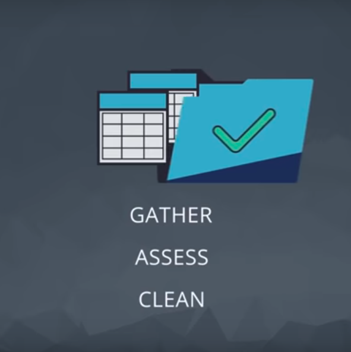
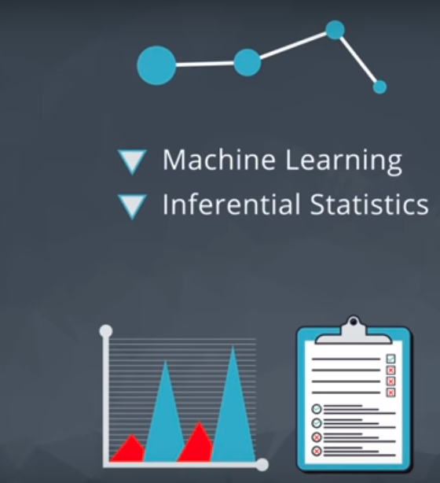

***We organized the data analysis process into five steps: Question, Wrangle, Explore, Draw Conclusions, and Communicate. Below is a review of the key points.***
---

# **Step 1: Ask questions**

Either you're given data and ask questions based on it, or you ask questions first and gather data based on that later. In both cases, great questions help you focus on relevant parts of your data and direct your analysis towards meaningful insights.

 
 
 
 
 
 
 
 
 

# **Step 2: Wrangle data**
You get the data you need in a form you can work with in three steps: gather, assess, clean. You gather the data you need to answer your questions, assess your data to identify any problems in your data’s quality or structure, and clean your data by modifying, replacing, or removing data to ensure that your dataset is of the highest quality and as well-structured as possible.

 
 
 
 
 
 
 
 
 

# **Step 3: Perform EDA (Exploratory Data Analysis)**
You explore and then augment your data to maximize the potential of your analyses, visualizations, and models. Exploring involves finding patterns in your data, visualizing relationships in your data, and building intuition about what you’re working with. After exploring, you can do things like remove outliers and create better features from your data, also known as feature engineering.

 
 
 
 
 
 
 
 
 

# **Step 4: Draw conclusions (or even make predictions)**
This step is typically approached with machine learning or inferential statistics.

 
 
 
 
 
 
 
 
 

# **Step 5: Communicate your results**
You often need to justify and convey meaning in the insights you’ve found. Or, if your end goal is to build a system, you usually need to share what you’ve built, explain how you reached design decisions, and report how well it performs. There are many ways to communicate your results: reports, slide decks, blog posts, emails, presentations, or even conversations. Data visualization will always be very valuable.
