# ```Entity Relationship Diagrams"ERD"```

---

## - ***Some times we need many spreadsheets to store data***

<p align="center">
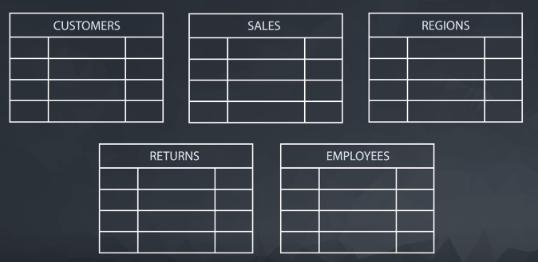
</p>

## - ***We can visualize the relationship between these spreadsheets using ERD***

<p align="center">
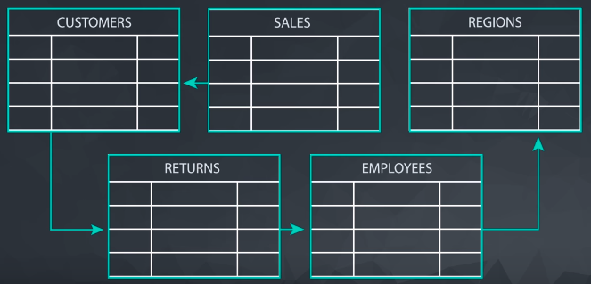
</p>
## - ***What's ERD?***


## - ***Each spreadsheet is represented on a table at the top the name of the table below          it the name of the columns.***

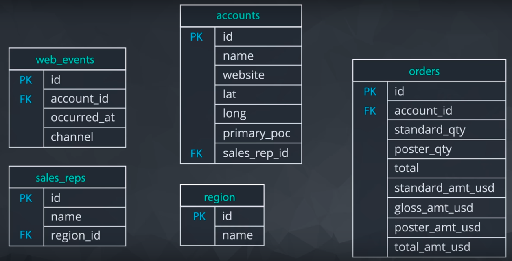

## - ***SQL is a language used to interact with a database, it can query across a table or        multiple tables***

<p align="center">
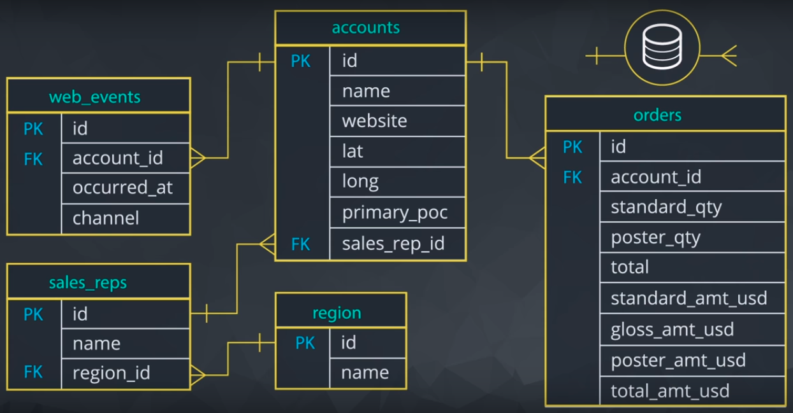
</p>

## - ***What to Notice:-***
  ### -In the Parch & Posey database there are five tables (essentially 5 spreadsheets):

  #### 1. web_events
  #### 2. accounts
  #### 3. orders
  #### 4. sales_reps
  #### 5. region
  
  ### ***You can think of each of these tables as an individual spreadsheet. Then the columns in each                           spreadsheet arelisted below the table name. For example, the <span style="color:orange">region</span> table has two columns: <code>id</code> and <code>name</code>. Alternatively the <span                           style="color:orange">web_events</span> table has four columns.***

  <p align="center">
  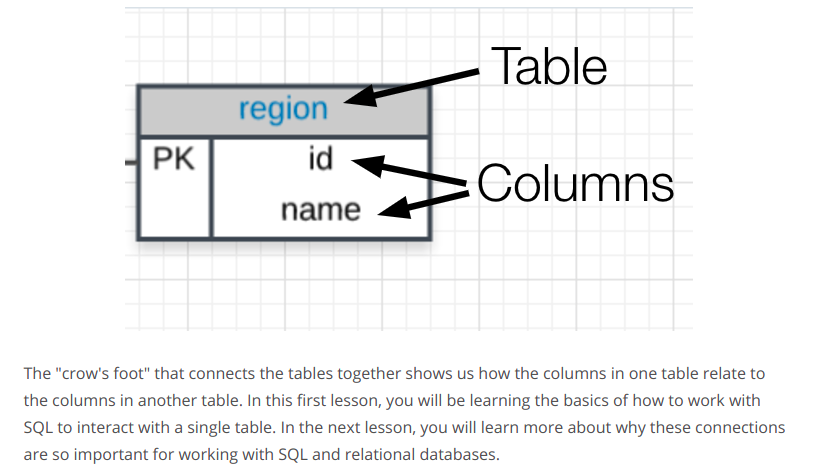
  </p>

---
# ```Why SQL?```
---

## - ***Why Do Data Analysts Use SQL?***
   ### - ***There are some major advantages to using <span style="color:orange">traditional relational                  databases</span>, which we interact with using SQL. The five most apparent are:***

   - #### SQL is easy to understand.
   - #### Traditional databases allow us to access data directly.
   - #### Traditional databases allow us to audit and replicate our data.
   - #### SQL is a great tool for analyzing multiple tables at once.
   - #### SQL allows you to analyze more complex questions than dashboard tools like Google Analytics.
   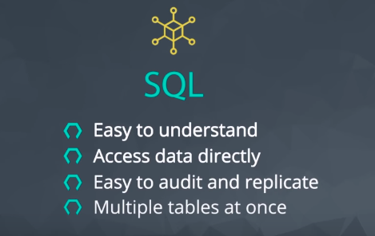
   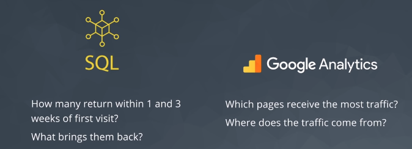
   
<br>
<br>
<br>

## - ***Why Businesses Like Databases?***
   

   ### 1. Data integrity is ensured - only the data you want entered is entered, and only certain users are able                 to enter data into the database. 
   
   
   ### 2. Data can be accessed quickly - SQL allows you to obtain results very quickly from the data stored in                 a database. Code can be optimized to quickly pull results. 
   <br>
   <br>
   
   
   
   ### 3. Data is easily shared - multiple individuals can access data stored in a database, and the data is the                 same for all users allowing for consistent results for anyone with access to your database.

---
# ```How Databases Store Data```
---

## 1. Data in databases is stored in tables that can be thought of just like Excel                            spreadsheets. 
- #### For the most part, you can think of a database as a bunch of Excel spreadsheets. Each spreadsheet has          rows and columns. Where each row holds data on a transaction, a person, ac ompany, etc., while each            column holds data pertaining to a particular aspect of one of the rows you care about like a name,              location, a unique id, etc.
## 2. All the data in the same column must match in terms of data type. 
- #### An entire column is considered quantitative, discrete, or as some sort of string. This means if you have        one row with a string in a particular column, the entire column might change to a text data type. <span        style="color:orange">This can be very bad if you want to do math with this column!</span>

## 3. Consistent column types are one of the main reasons working with databases is                fast. 
- #### Often databases hold a <span style="color:orange">LOT</span> of data. So, knowing that the columns are          all of the same type of data means that obtaining data from a database can still be fast.

<p align="center">
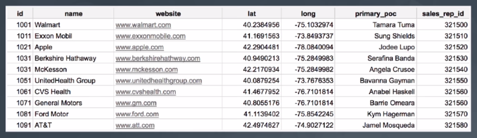
</p>

---
# ```Types of Databases```
---

## SQL Databases:-

- #### There are many different types of SQL databases designed for different purposes. In this course we will         use Postgres within the classroom, which is a popular open-source database with a very complete library         of analytical functions.

### Some of the most popular databases include:

- #### 1. MySQL  

<br>
<br>

- #### 2. Access 
<br>
<br>

- #### 3. Oracle 
<br>
<br>

- #### 4. Microsoft SQL Server 

<br>
<br>

- #### 5. Postgres 


- #### You can also write SQL within other programming frameworks like Python, Scala, and HaDoop.


<p align="center">
    
</p>


### Small Differences:-

- #### Each of these SQL databases may have subtle differences in syntax and available functions -- for                example, MySQL doesn’t have some of the functions for modifying dates as Postgres. <span                        style="color:orange">Most</span> of what you see with Postgres will be directly applicable to using SQL        in other frameworks and database environments. For the differences that do exist, you should check the          documentation. Most SQL environments have great documentation online that you can easily access with a          quick Google search.

- #### The article [here](https://www.digitalocean.com/community/tutorials/sqlite-vs-mysql-vs-postgresql-a-comparison-of-relational-database-management-systems) compares three of the most common types of SQL:                  SQLite, PostgreSQL, and MySQL.

- #### You will use PostgreSQL for the lessons in this course, but you are not required to download it to your        machine. We provide SQL workspaces in the classroom throughout the lessons. You may download PostgreSQL        [here](https://www.postgresql.org/) if you'd like though.

---
# ```Types of Statements```
---
<p align="center">
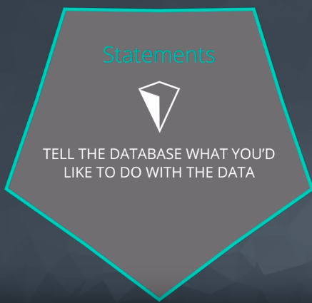
</p>

## The key to SQL is understanding <span style="color:orange">statements</span>. A few statements include:
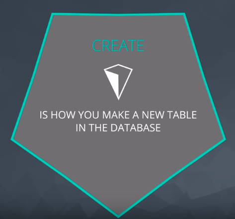
<br>
<br>

- ### 1. <span style="color:orange">CREATE TABLE</span> is a statement that creates a new table in a database.
<br>
<br>
<br>
<br>
<br>
<br>
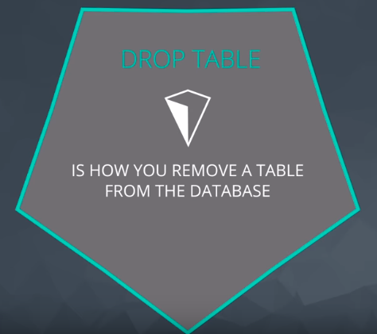
<br>
<br>


- ### 2. <span style="color:orange">DROP TABLE</span> is a statement that removes a table in a database.
<br>
<br>
<br>
<br>
<br>
<br>

<br>
<br>

- ### 3. <span style="color:orange">SELECT</span> allows you to read data and display it. This is called a <span style="color:orange">query</span>.

---
# ```SELECT & FROM```
---

> # SELECT STATEMENT:-
<p align="center">
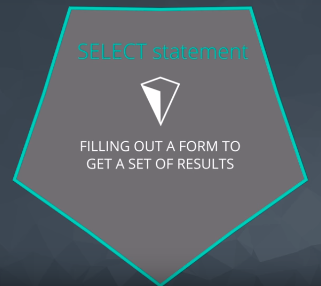
</p>

# 1. <span style="color:orange">SELECT</span> indicates which column(s) you want to be given the data for.
<p align="center">

</p>

# 2. <span style="color:orange">FROM</span> specifies from which table(s) you want to select the columns. Notice the columns need to exist in this table.

<p align="center">

</p>

# Pro Tips:-


<br>
<br>
<br>
<br>
<br>
<br>
<br>

# SQL Code:-

```sql
    SELECT *
    FROM orders
```

---
# ```Formatting Best Practices```
---

# Formatting Your Queries:-

## Using Upper and Lower Case in SQL
---
  - ### SQL queries can be run successfully whether characters are written in upper- or lower-case. In other       words, SQL queries are not case-sensitive. The following query:

```sql
    SELECT *
    FROM orders
```
    
  - ### is the same as:

```sql
    select account_id
    from orders
```
  - ### which is also the same as:

```sql
     SeLeCt AcCoUnt_id
     FrOm oRdErS
```
  - ### <span style="color:orange">However</span>, you may have noticed that we have been capitalizing SELECT       and FROM, while we leave table and column names in lower case. This is because even though SQL is case-         insensitive,<span style="color:orange">it is common and best practice to capitalize all SQL commands, like     SELECT and FROM, and keep everything else in your query lower case.</span>
  
  - ### Capitalizing command words makes queries easier to read, which will matter more as you write more           complex queries. For now, it is just a good habit to start getting into, to make your SQL queries more         readable.

  - ### One other note: The text data stored in SQL tables can be either upper or lower case, and SQL is case-     sensitive in regard to this text data.


## Avoid Spaces in Table and Variable Names
---
  - #### It is common to use underscores and avoid spaces in column names. It is a bit annoying to work with       spaces in SQL. In Postgres if you have spaces in column or table names, you need to refer to these             columns/tables with double quotes around them (Ex: FROM "Table Name" as opposed to FROM table_name). In         other environments, you might see this as square brackets instead (Ex: FROM [Table Name]).
  

## Use White Space in Queries
---
  - ### SQL queries ignore spaces, so you can add as many spaces and blank lines between code as you want, and     the queries are the same. This query

```sql
     SELECT account_id FROM orders
```
  
  - ### is equivalent to this query:

```sql
    SELECT account_id
    FROM orders
```

  - ### and this query (but please don't ever write queries like this):

```sql
    SELECT              account_id
    FROM               orders
```

## Semicolons
---
  - ### Depending on your SQL environment, your query may need a semicolon at the end to execute. Other             environments are more flexible in terms of this being a "requirement." It is considered best practice to       put a semicolon at the end of each statement, which also allows you to run multiple queries at once if your     environment allows this.
    
   - ### Best practice:

```sql
      SELECT account_id
      FROM orders;
```
     
   - ### Since our environment here doesn't require it, you will see solutions written without the semicolon:

```sql
     SELECT account_id
     FROM orders
```

---
# ```LIMIT```
---

## <span style="color:orange">LIMIT</span> statement is useful when you want to see just the first few rows of a table. This can be much faster for loading than if we load the entire dataset.

## Pro Tips:-


<br>
<br>
<br>
<br>
<br>
<br>
<br>
<br>

## The <span style="color:orange">LIMIT</span> command is always the very last part of a query. An example of showing just the first 10 rows of the orders table with all of the columns might look like the following:

```sql
  SELECT *
  FROM orders
  LIMIT 10;
```

### We could also change the number of rows by changing the 10 to any other number of rows.
---
# ```ORDER BY```
---

## The <span style="color:orange">ORDER BY</span> statement allows us to sort our results using the data in any column. If you are familiar with Excel or Google Sheets, using <span style="color:orange">ORDER BY</span>  is similar to sorting a sheet using a column. A key difference, however, is that <span style="color:orange">using ORDER BY in a SQL query only has temporary effects, for the results of that query, unlike sorting a sheet by column in Excel or Sheets</span>.

## In other words, when you use ORDER BY in a SQL query, your output will be sorted that way, but then the next query you run will encounter the unsorted data again. It's important to keep in mind that this is different than using common spreadsheet software, where sorting the spreadsheet by column actually alters the data in that sheet until you undo or change that sorting. This highlights the meaning and function of a SQL "query."

## The ORDER BY statement always comes in a query after the SELECT and FROM statements, but before the LIMIT statement. If you are using the LIMIT statement, it will always appear last. As you learn additional commands, the order of these statements will matter more.

## Pro Tips:-


<p align="center">

</p>

> ## we can <span style="color:orange">ORDER BY</span> more than one column at a time. When you provide a list of columns in an <span style="color:orange">ORDER BY</span> command, the sorting occurs using the leftmost column in your list first, then the next column from the left, and so on. We still have the ability to flip the way we order using <span style="color:orange">DESC</span>.

> ## If we ordered the values according to <code>total_amt_usd</code> <span style="color:orange">DESC</span> then <code>account_id</code> from smallest to largest the results will be ordered first according to <code>total_amt_usd</code> and if the two columns had the same values it will be ordered according to <code>account_id</code> from smallest tp largest.

## ORDER BY Examples:-

1. ```sql
    SELECT id, occurred_at, total_amt_usd
    FROM orders
    ORDER BY occurred_at
    LIMIT 10;

2. ```sql
    SELECT id, occurred_at, total_amt_usd
    FROM orders
    ORDER BY total_amt_usd DESC
    LIMIT 5;
    
3. ```sql
    SELECT id, occurred_at, total_amt_usd
    FROM orders
    ORDER BY total_amt_usd
    LIMIT 20;

    
4. ```sql
    SELECT id, account_id, total_amt_usd
    FROM orders
    ORDER BY account_id, total_amt_usd DESC;
    
5. ```sql
    SELECT id, account_id, total_amt_usd
    FROM orders
    ORDER BY total_amt_usd DESC, account_id;

    
  ### In query #4, all of the orders for each account ID are grouped together, and then within each of those        groupings, the orders appear from the greatest order amount to the least. In query #5, since you sorted by      the total dollar amount first, the orders appear from greatest to least regardless of which account ID they        were from. Then they are sorted by account ID next. (The secondary sorting by account ID is difficult to see    here, since only if there were two orders with equal total dollar amounts would there need to be any sorting    by account ID.)

# ``` WHERE```
---

## WHERE Clause:-
  - ### we can display subsets of tables based on conditions that must be met. You can also think of the <span     style="color:orange">WHERE</span> command as filtering the data.
  <p align="center">
  
  </p>
  
## Common symbols used in <span style="color:orange">WHERE</span> statements include:
  ### 1. <code> > </code> (greater than)
  ### 2. <code> < </code> (less than)
  ### 3. <code> >= </code> (greater than or equal to)
  ### 4. <code> <= </code> (less than or equal to)
  ### 5. <code> = </code> (equal to)
  ### 6. <code> != </code> (not equal to)
  
 
## WHERE Examples:-
1. ```sql
     SELECT *
     FROM orders
     WHERE gloss_amt_usd >= 1000
     LIMIT 5;
     
2. ```sql
     SELECT *
     FROM orders
     WHERE total_amt_usd < 500
     LIMIT 10;
     
## WHERE & NON-Numeric Data:-
  - ### The <span style="color:orange">WHERE</span> statement can also be used with non-numeric data. We can       use the <code>=</code> and <code>!=</code> operators here. You need to be sure to use single quotes (just       be careful if you have quotes in the original text) with the text data, not double quotes.
  
  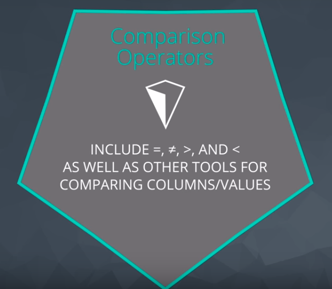
  
  <br>
  <br>
  <br>
  <br>
  <br>

<blockquote>
<p style="text-align:center;font-size:20px">  
<strong>Commonly when we are using WHERE with non-numeric data fields, we use the LIKE, NOT, or IN operators</strong>
</p>
</blockquote>

## WHERE & NON-Numeric Data Examples:-
```sql
     SELECT name, website, primary_poc
     FROM accounts
     WHERE name = 'Exxon Mobil';
```

# ```Arithmetic Operators```
---

## Derived Columns:-
  - ### Creating a new column that is a combination of existing columns is known as a <span                         style="color:orange">derived</span> column (or "calculated" or "computed" column). Usually you want to give     a name, or "alias," to your new column using the <span style="color:orange">AS</span> keyword.

  <p align="center">
  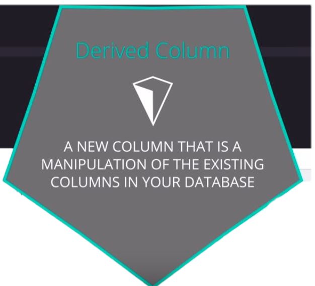
  </p>
  
  - ### This derived column, and its alias, are generally only temporary, existing just for the duration of         your query. The next time you run a query and access this table, the new column will not be there.

  - ### If you are deriving the new column from existing columns using a mathematical expression, then these       familiar mathematical operators will be useful:
  
   #### 1. <code> * </code> (Multiplication)
   #### 2. <code> + </code> (Addition)
   #### 3. <code> - </code> (Subtraction)
   #### 4. <code> / </code> (Division)
   
  
  - ### Consider this example:
```sql
     SELECT id, (standard_amt_usd/total_amt_usd)*100 AS std_percent, total_amt_usd
     FROM orders
     LIMIT 10;
```
     
  - ### Here we divide the standard paper dollar amount by the total order amount to find the standard paper       percent for the order, and use the <span style="color:orange">AS</span> keyword to name this new column         "std_percent." You can run this query on the next page if you'd like, to see the output.
  
## Order of Operations:-
  - ### Remember PEMDAS from math class to help remember the order of operations? If not, check out this [link](http://www.purplemath.com/modules/orderops.htm) as a reminder. The same order of operations applies when using     arithmetic operators in SQL.
  
  - ### The following two statements have very different end results:

    #### 1. Standard_qty / standard_qty + gloss_qty + poster_qty
    #### 2. standard_qty / (standard_qty + gloss_qty + poster_qty)

### Arithmetic Operators Examples:-

1. ```sql
       SELECT id, account_id, standard_amt_usd/standard_qty AS unit_price
       FROM orders
       LIMIT 10;
       ```

2. ```sql
       SELECT id, account_id, 
       poster_amt_usd/(standard_amt_usd + gloss_amt_usd + poster_amt_usd) AS post_per
       FROM orders
       LIMIT 10;
       ```

---

# ```Logical Operators```

---
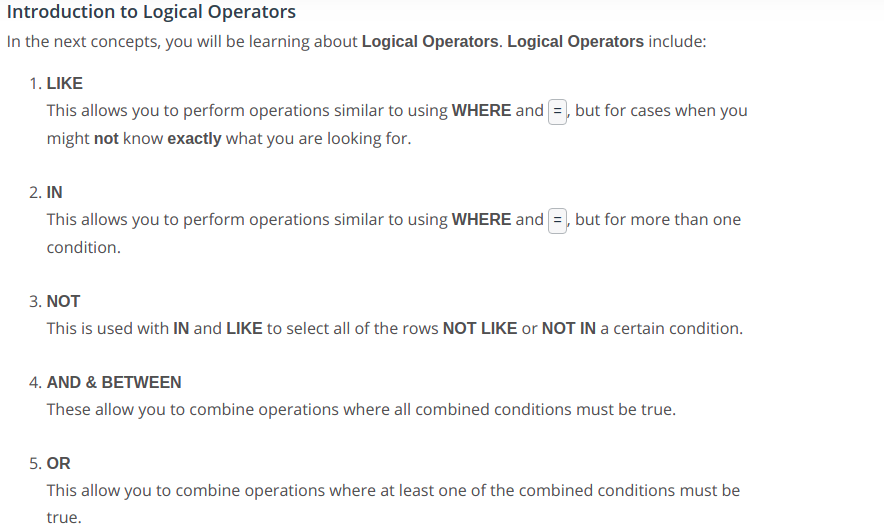

---

# ```LIKE```

---

## **The <span style="color:orange">LIKE</span> operator is extremely useful for working with text. You will use <span style="color:orange">LIKE</span> within a <span style="color:orange">WHERE</span> clause. The <span style="color:orange">LIKE</span> operator is frequently used with <code>%</code>. The <code>%</code> tells us that we might want any number of characters leading up to a particular set of characters or following a certain set of characters, as we saw with the <span style="color:orange">google</span> syntax above. Remember you will need to use single quotes for the text you pass to the <span style="color:orange">LIKE</span> operator, because of this lower and uppercase letters are not the same within the string. Searching for <span style="color:orange">'T'</span> is not the same as searching for <span style="color:orange">'t'</span>. In other SQL environments (outside the classroom), you can use either single or double quotes.**

## Pro Tips:-
---


<p align="center">
    
</p>

## LIKE Examples:-

---

 1. ```sql
     SELECT name
     FROM accounts
     WHERE name LIKE 'C%';
     ```  

 2. ```sql
     SELECT name
     FROM accounts
     WHERE name LIKE '%one%';
     ```

 3. ```sql
     SELECT name
     FROM accounts
     WHERE name LIKE '%s';
     ```

---

# ```IN```

---

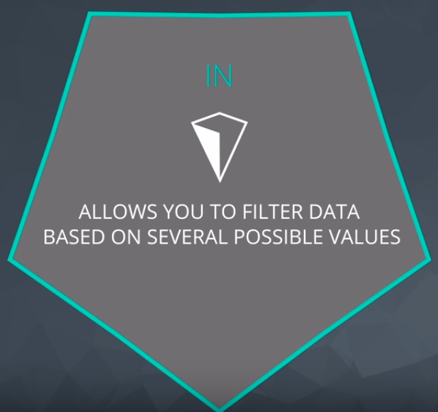

## The <span style="color:orange">IN</span> operator is useful for working with both numeric and text columns. This operator allows you to use an <code>=</code>, but for more than one item of that particular column. We can check one, two or many column values for which we want to pull data, but all within the same query. In the upcoming concepts, you will see the <span style="color:orange">OR</span> operator that would also allow us to perform these tasks, but the <span style="color:orange">IN</span> operator is a cleaner way to write these queries.

## Pro Tips:-

---


<br>
<br>
<br>
<br>

<p style="text-align:center">
<strong>In most SQL environments, although not in our Udacity's classroom, you can use single or double                 quotation marks - and you may NEED to use double quotation marks if you have an apostrophe within the           text you are attempting to pull.</strong>
</p>

## IN Examples:-

   1. ```sql
      SELECT name, primary_poc, sales_rep_id
      FROM accounts
      WHERE name IN ('Walmart', 'Target', 'Nordstrom');
      ```

   2. ```sql
      SELECT *
      FROM web_events
      WHERE channel IN ('organic', 'adwords');
      ```  

---

# **```NOT```**

---

## **The <span style="color:orange">NOT</span> operator is an extremely useful operator for working with the previous two operators we introduced: <span style="color:orange">IN</span> and <span style="color:orange">LIKE</span>. By specifying <span style="color:orange">NOT LIKE</span> or <span style="color:orange">NOT IN</span>, we can grab all of the rows that do not meet a particular criteria.**

<p align="center">
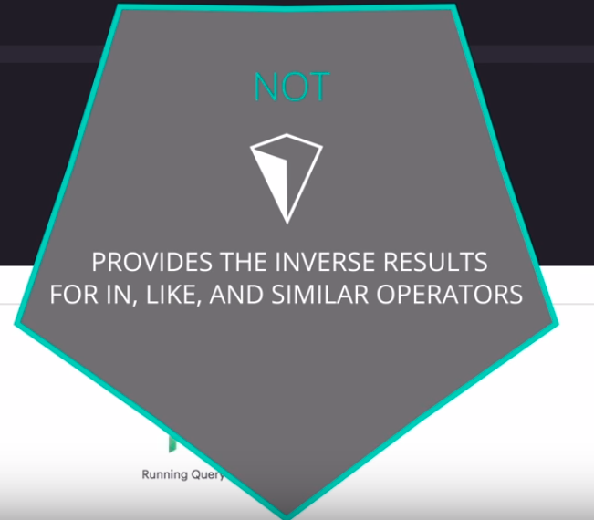
</p>

## NOT Examples:-

  1. ```sql
      SELECT name, primary_poc, sales_rep_id
      FROM accounts
      WHERE name NOT IN ('Walmart', 'Target', 'Nordstrom');
      ```

  2. ```sql
      SELECT *
      FROM web_events
      WHERE channel NOT IN ('organic', 'adwords');
      ```

  3. ```sql
      SELECT name
      FROM accounts
      WHERE name NOT LIKE 'C%';
      ```

  4. ```sql
      SELECT name
      FROM accounts
      WHERE name NOT LIKE '%one%';
      ```

  5. ```sql
      SELECT name
      FROM accounts
      WHERE name NOT LIKE '%s';
      ```

---

# ```AND and BETWEEN```

---

## **The <span style="color:orange">AND</span> operator is used within a <span style="color:orange">WHERE</span> statement to consider more than one logical clause at a time. Each time you link a new statement with an <span style="color:orange">AND</span>, you will need to specify the column you are interested in looking at. You may link as many statements as you would like to consider at the same time. This operator works with all of the operations we have seen so far including arithmetic operators (<code>+</code>, <code>*</code>, <code>-</code>, <code>/</code>). <span style="color:orange">LIKE</span>, <span style="color:orange">IN</span>, and <span style="color:orange">NOT</span> logic can also be linked together using the <span style="color:orange">AND</span> operator.**

## BETWEEN Operator:-

  - ### **Sometimes we can make a cleaner statement using <span style="color:orange">BETWEEN</span> than we can using <span style="color:orange">AND</span>. Particularly this is true when we are using the same column for different parts of our <span style="color:orange">AND</span> statement. In the previous video, we probably should have used <span style="color:orange">BETWEEN</span>.**

  - ### **Instead of writing :**

    ```sql
        WHERE column >= 6 AND column <= 10
    ```

  - ### **we can instead write, equivalently:**

    ```sql
        WHERE column BETWEEN 6 AND 10
    ```

## AND & BETWEEN Examples:-

  1. ```sql
      SELECT *
      FROM orders
      WHERE standard_qty > 1000 AND poster_qty = 0 AND gloss_qty = 0;
      ```

  2. ```sql
      SELECT name
      FROM accounts
      WHERE name NOT LIKE 'C%' AND name LIKE '%s';
      ```

  3. ```sql
      SELECT occurred_at, gloss_qty 
      FROM orders
      WHERE gloss_qty BETWEEN 24 AND 29;
      ```

  4. ```sql
      SELECT *
      FROM web_events
      WHERE channel IN ('organic', 'adwords') AND occurred_at BETWEEN '2016-01-01' AND '2017-01-01'
      ORDER BY occurred_at DESC;
      ```

---

# ```OR```

---

## **Similar to the <span style="color:orange">AND</span> operator, the <span style="color:orange">OR</span> operator can combine multiple statements. Each time you link a new statement with an <span style="color:orange">OR</span>, you will need to specify the column you are interested in looking at. You may link as many statements as you would like to consider at the same time. This operator works with all of the operations we have seen so far including arithmetic operators (<code>+</code>, <code>*</code>, <code>-</code>, <code>/</code>), LIKE, IN, NOT, <span style="color:orange">AND</span>, and <span style="color:orange">BETWEEN</span> logic can all be linked together using the <span style="color:orange">OR </span>operator.**

## **When combining multiple of these operations, we frequently might need to use parentheses to assure that logic we want to perform is being executed correctly. The video below shows an example of one of these situations.**

## OR Examples:-

  1. ```sql
      SELECT id
      FROM orders
      WHERE gloss_qty > 4000 OR poster_qty > 4000;
      ```

  2. ```sql
      SELECT *
      FROM orders
      WHERE standard_qty = 0 AND (gloss_qty > 1000 OR poster_qty > 1000);
      ```

  3. ```sql
      SELECT *
      FROM accounts
      WHERE (name LIKE 'C%' OR name LIKE 'W%')
           AND ((primary_poc LIKE '%ana%' OR primary_poc LIKE '%Ana%')
           AND primary_poc NOT LIKE '%eana%');
      ```

---

# ```Commands Summary```

---

|Statement|How to Use It         |Other Details|
|---------|----------------------|-------------|
|SELECT   |SELECT **Col1, Col2**, ...|Provide the columns you want|
|FROM|FROM **Table**|Provide the table where the columns exist|
|LIMIT|LIMIT **10**|Limits based number of rows returned|
|ORDER BY|ORDER BY **Col**|Orders table based on the column. Used with **DESC**.|
|WHERE|WHERE **Col > 5**|A conditional statement to filter your results|
|LIKE|WHERE **Col LIKE '%me%'**|Only pulls rows where column has 'me' within the text|
|IN|WHERE **Col IN ('Y', 'N')**|A filter for only rows with column of 'Y' or 'N'|
|NOT|WHERE **Col NOT IN ('Y', 'N')**|**NOT** is frequently used with **LIKE** and **IN**|
|AND|WHERE **Col1 > 5 AND Col2 < 3**|Filter rows where two or more conditions must be true|
|OR|WHERE **Col1 > 5 OR Col2 < 3**|Filter rows where at least one condition must be true|
|BETWEEN|WHERE **Col BETWEEN 3 AND 5**|Often easier syntax than using an **AND**|