# ```Database Normalization```

---

### When creating a database, it is really important to think about how data will be stored. This is known as <u>normalization</u>, and it is a huge part of most SQL classes. If you are in charge of setting up a new database, it is important to have a thorough understanding of database <u>normalization</u>.

### **There are essentially three ideas that are aimed at database normalization:**

- **1. Are the tables storing logical groupings of the data?**

- **2. Can I make changes in a single location, rather than in many tables for the same information?**

- **3. Can I access and manipulate data quickly and efficiently?**

### **This is discussed in detail [here](http://sqlmag.com/database-performance-tuning/sql-design-why-you-need-database-normalization).**

### **However, most analysts are working with a database that was already set up with the necessary properties in place. As analysts of data, you don't really need to think too much about data <u>normalization</u>. You just need to be able to pull the data from the database, so you can start making insights.**

---

# ```JOINs:-```

---

<p align="center">

</p>

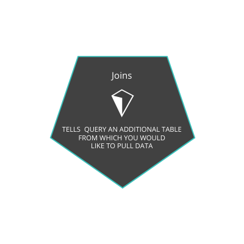

### **The whole purpose of <u>JOIN</u> statements is to allow us to pull data from more than one table at a time.**

### **<u>JOINs</u> are useful for allowing us to pull data from multiple tables. This is both simple and powerful all at the same time.**

<br>
<br>
<br>
<br>

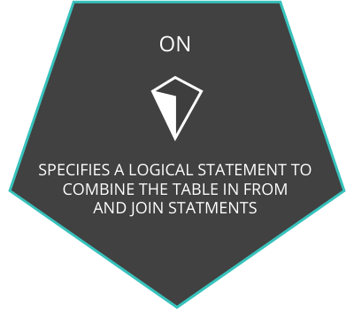

### **With the addition of the <u>JOIN</u> statement to our toolkit, we will also be adding the <u>ON</u> statement.**

<br>
<br>

## **JOIN Examples:-**

1. ```sql
    SELECT orders.*
    FROM orders
    JOIN accounts
    ON orders.account_id =accounts.id;
   ```

2. ```sql
    SELECT orders.standard_qty, orders.gloss_qty, 
       orders.poster_qty,  accounts.website, 
       accounts.primary_poc
    FROM orders
    JOIN accounts
    ON orders.account_id = accounts.id;
    ```

3. ```sql
    SELECT *
    FROM web_events
    JOIN accounts
    ON web_events.account_id = accounts.id
    JOIN orders
    ON accounts.id = orders.account_id;
    ```

---

# ```Primary and Foreign Keys```

---

### **Primary Key (PK):-**

  - **A <u>primary key</u> is a unique column in a particular table. This is the first column in each of our tables. Here, those columns are all called id, but that doesn't necessarily have to be the name. <u>It is common that the primary key is the first column in our tables in most databases.</u>**

 ### **Foreign Key (FK):-**

  - **A foreign key is a column in one table that is a primary key in a different table. We can see in the Parch & Posey ERD that the foreign keys are:**
    
    - 1. **region_id**
    - 2. **account_id**
    - 3. **sales_rep_id**

### **Each of these is linked to the <u>primary key</u> of another table. An example is shown in the image below:**

<p align="center">
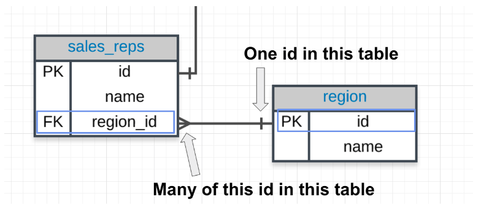
</p>

### **Primary - Foreign Key Link:-**

  - #### **In the above image you can see that:**

     1. **The <u>region_id</u> is the foreign key.**
     2. **The region_id is <u>linked</u> to id - this is the primary-foreign key link that connects these two tables.**
     3. **The crow's foot shows that the <u>FK</u> can actually appear in many rows in the <u>sales_reps</u> table.**
     4. **While the single line is telling us that the <u>PK</u> shows that id appears only once per row in this table.**

---

# ```ALIAS```

---

#### **When we JOIN tables together, it is nice to give each table an alias. Frequently an alias is just the first letter of the table name. You actually saw something similar for column names in the Arithmetic Operators concept.**

### **ALIAS Example:-**

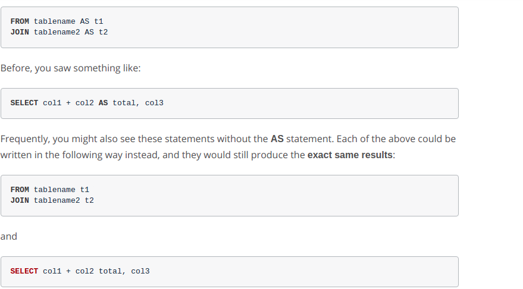

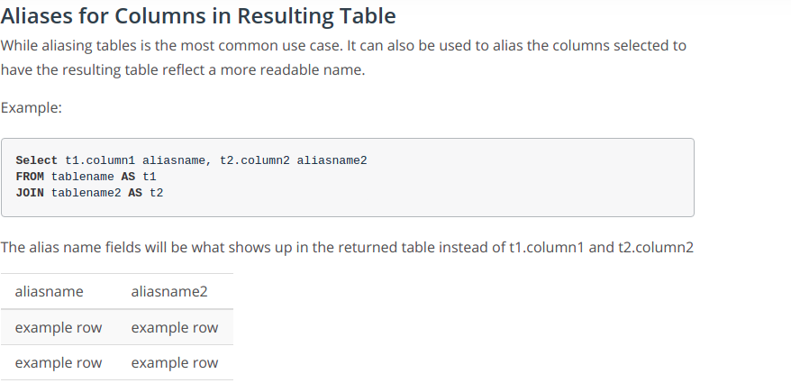

1. ```sql
    SELECT r.name region, s.name rep, a.name account
    FROM sales_reps s
    JOIN region r
    ON s.region_id = r.id
    JOIN accounts a
    ON a.sales_rep_id = s.id
    ORDER BY a.name;
    ```

2. ```sql
    SELECT r.name region, a.name account,
       o.total_amt_usd/(o.total + 0.01) unit_price
    FROM region r
    JOIN sales_reps s
    ON s.region_id = r.id
    JOIN accounts a
    ON a.sales_rep_id = s.id
    JOIN orders o
    ON o.account_id = a.id;
    ```

---

# ```INNER JOIN```

---


<br>

### **Only returns rows that appear in both tables.**
<p align="center">
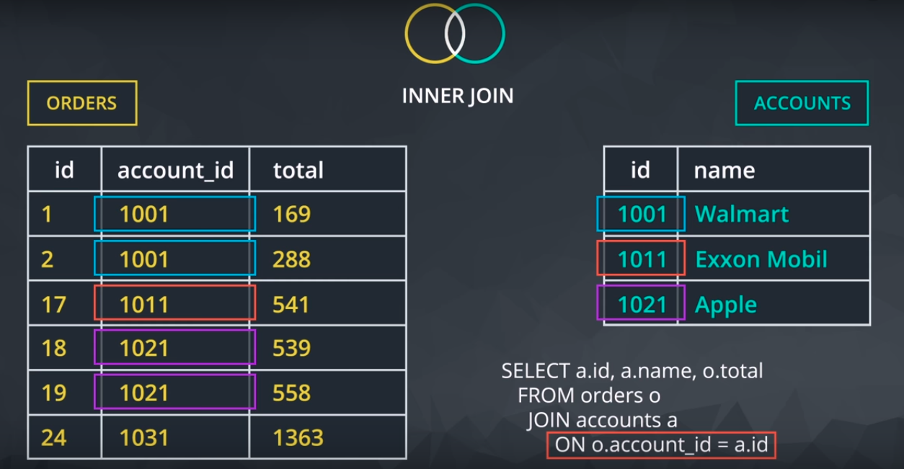
</p>

### Left & Right Tables:-
 
 <p align="center">
 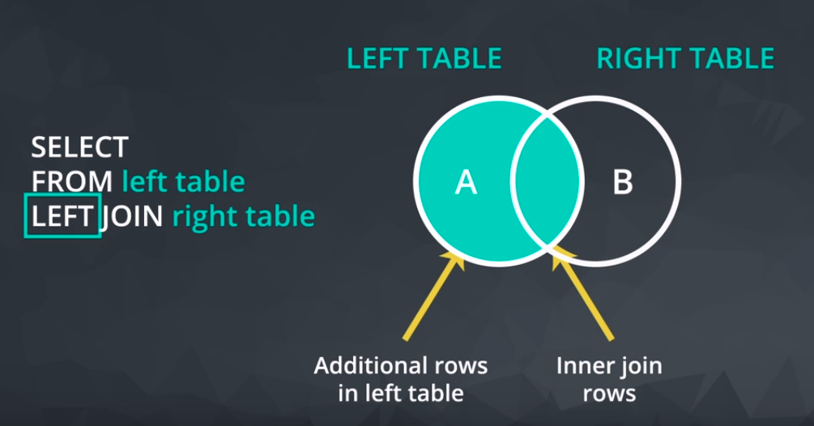
 </p>

### LEFT JOIN:-
 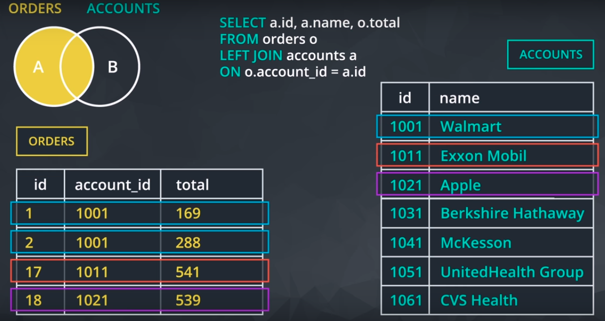

 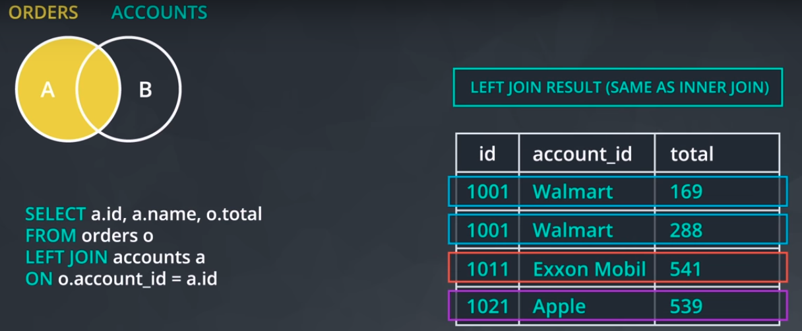

<br>
<br>
<br>
<br>
<br>
<br>
<br>

### Right JOIN:-
 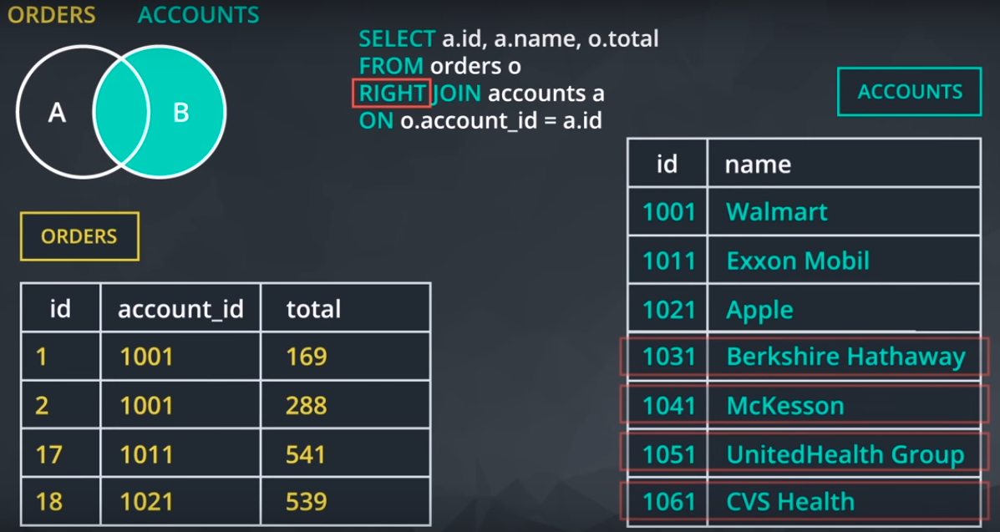

 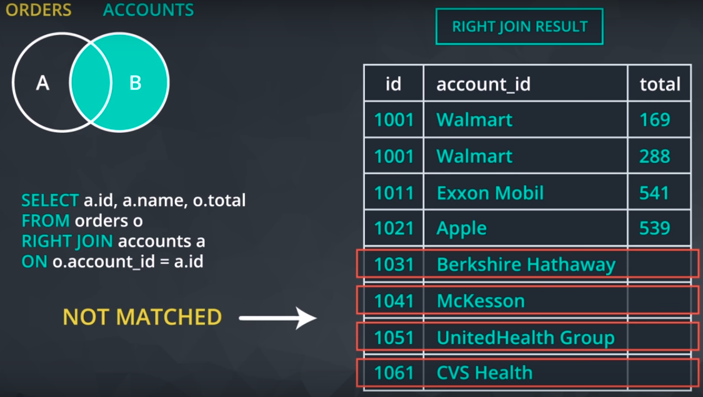

<br>
<br>
<br>
<br>
<br>
<br>
<br>

#### ***If there is not matching information in the <u>JOIN</u>ed table, then you will have columns with empty cells. These empty cells introduce a new data type called <u>NULL</u>. You will learn about <u>NULL</u>s in detail in the next lesson, but for now you have a quick introduction as you can consider any cell without data as <u>NULL</u>.***

### **Other JOIN Notes:-**
  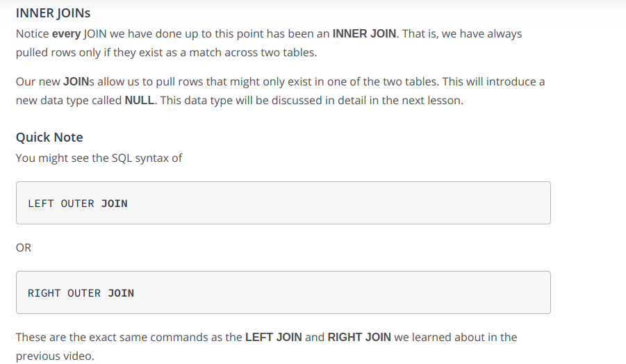

#### **OUTER JOINS:**

- **The last type of join is a full outer join. This will return the inner join result set, as well as any unmatched rows from either of the two tables being joined.**

- **Again this returns rows that <u>do not match</u> one another from the two tables. The use cases for a full outer join are <u>very rare</u>.**

- **You can see examples of outer joins at the link [here](http://www.w3resource.com/sql/joins/perform-a-full-outer-join.php) and a description of the rare use cases [here](https://stackoverflow.com/questions/2094793/when-is-a-good-situation-to-use-a-full-outer-join). We will not spend time on these given the few instances you might need to use them.**

- **Similar to the above, you might see the language <u>FULL OUTER JOIN</u>, which is the same as <u>OUTER JOIN</u>.**

#### **A simple rule to remember this is that, when the database executes this query, it executes the join and everything in the <u>ON</u> clause first. Think of this as building the new result set. That result set is then filtered using the <u>WHERE</u> clause.**

#### **The fact that this example is a left join is important. Because inner joins only return the rows for which the two tables match, moving this filter to the <u>ON</u> clause of an inner join will produce the same result as keeping it in the <u>WHERE</u> clause.**

### **Pro Tips:-**

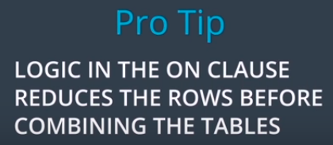

<p align="center">

</p>

### **JOIN Examples:-**

1. **Provide a table that provides the region for each sales_rep along with their associated accounts. This time only for the Midwest region. Your final table should include three columns: the region name, the sales rep name, and the account name. Sort the accounts alphabetically (A-Z) according to account name.**

    ```sql
    SELECT r.name region, s.name rep, a.name account
    FROM sales_reps s
    JOIN region r
    ON s.region_id = r.id
    JOIN accounts a
    ON a.sales_rep_id = s.id
    WHERE r.name = 'Midwest'
    ORDER BY a.name;
    ```

2. **Provide a table that provides the region for each sales_rep along with their associated accounts. This time only for accounts where the sales rep has a first name starting with S and in the Midwest region. Your final table should include three columns: the region name, the sales rep name, and the account name. Sort the accounts alphabetically (A-Z) according to account name.**

    ```sql
    SELECT r.name region, s.name rep, a.name account
    FROM sales_reps s
    JOIN region r
    ON s.region_id = r.id
    JOIN accounts a
    ON a.sales_rep_id = s.id
    WHERE r.name = 'Midwest' AND s.name LIKE 'S%'
    ORDER BY a.name;
    ```

3. **Provide a table that provides the region for each sales_rep along with their associated accounts. This time only for accounts where the sales rep has a last name starting with K and in the Midwest region. Your final table should include three columns: the region name, the sales rep name, and the account name. Sort the accounts alphabetically (A-Z) according to account name.**

     ```sql
    SELECT r.name region, s.name rep, a.name account
    FROM sales_reps s
    JOIN region r
    ON s.region_id = r.id
    JOIN accounts a
    ON a.sales_rep_id = s.id
    WHERE r.name = 'Midwest' AND s.name LIKE '% K%'
    ORDER BY a.name;
    ```

4. **Provide the name for each region for every order, as well as the account name and the unit price they paid (total_amt_usd/total) for the order. However, you should only provide the results if the standard order quantity exceeds 100. Your final table should have 3 columns: region name, account name, and unit price.**

    ```sql
    SELECT r.name region, a.name account, o.total_amt_usd/(o.total + 0.01) unit_price
    FROM region r
    JOIN sales_reps s
    ON s.region_id = r.id
    JOIN accounts a
    ON a.sales_rep_id = s.id
    JOIN orders o
    ON o.account_id = a.id
    WHERE o.standard_qty > 100;
    ```

5. **Provide the name for each region for every order, as well as the account name and the unit price they paid (total_amt_usd/total) for the order. However, you should only provide the results if the standard order quantity exceeds 100 and the poster order quantity exceeds 50. Your final table should have 3 columns: region name, account name, and unit price. Sort for the smallest unit price first.**

    ```sql
    SELECT r.name region, a.name account, o.total_amt_usd/(o.total + 0.01) unit_price
    FROM region r
    JOIN sales_reps s
    ON s.region_id = r.id
    JOIN accounts a
    ON a.sales_rep_id = s.id
    JOIN orders o
    ON o.account_id = a.id
    WHERE o.standard_qty > 100 AND o.poster_qty > 50
    ORDER BY unit_price;
    ```

6. **Provide the name for each region for every order, as well as the account name and the unit price they paid (total_amt_usd/total) for the order. However, you should only provide the results if the standard order quantity exceeds 100 and the poster order quantity exceeds 50. Your final table should have 3 columns: region name, account name, and unit price. Sort for the largest unit price first.**

    ```sql
    SELECT r.name region, a.name account, o.total_amt_usd/(o.total + 0.01) unit_price
    FROM region r
    JOIN sales_reps s
    ON s.region_id = r.id
    JOIN accounts a
    ON a.sales_rep_id = s.id
    JOIN orders o
    ON o.account_id = a.id
    WHERE o.standard_qty > 100 AND o.poster_qty > 50
    ORDER BY unit_price DESC;
    ```

7. **What are the different channels used by account id 1001? Your final table should have only 2 columns: account name and the different channels. You can try SELECT DISTINCT to narrow down the results to only the unique values.**

    ```sql
    SELECT DISTINCT a.name, w.channel
    FROM accounts a
    JOIN web_events w
    ON a.id = w.account_id
    WHERE a.id = '1001';
    ```

8. **Find all the orders that occurred in 2015. Your final table should have 4 columns: occurred_at, account name, order total, and order total_amt_usd.**

    ```sql
    SELECT o.occurred_at, a.name, o.total, o.total_amt_usd
    FROM accounts a
    JOIN orders o
    ON o.account_id = a.id
    WHERE o.occurred_at BETWEEN '01-01-2015' AND '01-01-2016'
    ORDER BY o.occurred_at DESC;
    ```

#### **There are a few more advanced <u>JOIN</u>s that we did not cover here, and they are used in very specific use cases. [UNION and UNION ALL](https://www.w3schools.com/sql/sql_union.asp), [CROSS JOIN](http://www.w3resource.com/sql/joins/cross-join.php), and the tricky [SELF JOIN](https://www.w3schools.com/sql/sql_join_self.asp). These are more advanced than this course will cover, but it is useful to be aware that they exist, as they are useful in special cases.**