# ```What are Measures of Spread?```

---

#### **Measures of Spread are used to provide us an idea of how spread out our data are from one another.**
<p align="center">
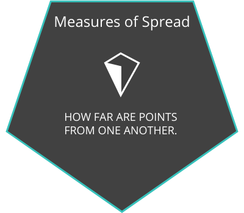
</p>

## Common Measures of Spread:-
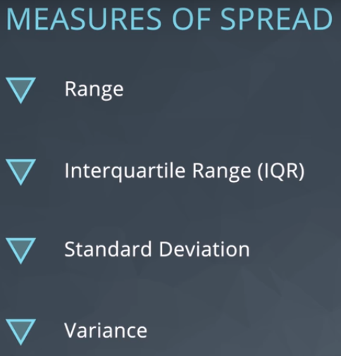

1. **Range**
<br>
<br>

2. **Interquartile Range (IQR)**
<br>
<br>

3. **Standard Deviation**
<br>
<br>

4. **Variance**
<br>
<br>
<br>
---

# ```Histogram```

---
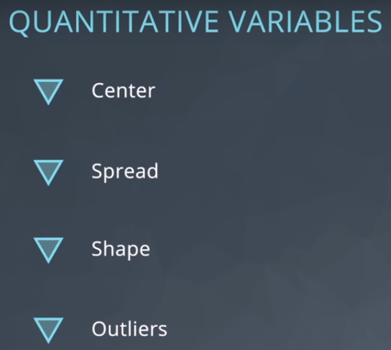


### **Histograms are super useful to understanding the different aspects of quantitative data. In the upcoming concepts, you will see histograms used all the time to help you understand the four aspects.**
<p align="center">

</p>

## **How Histograms constracted?**

<p align="center">
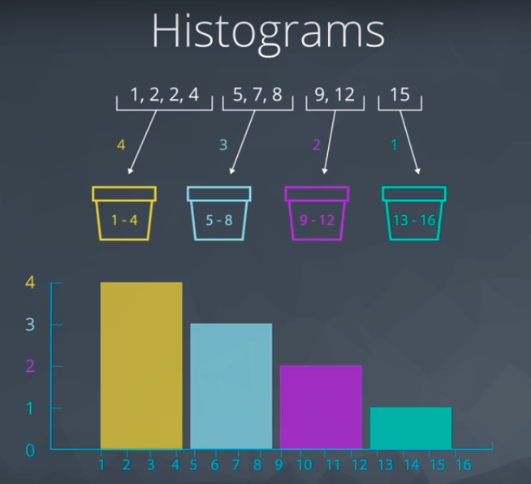
</p>

## **For Example:-**
- **Here, are two histograms comparing The number of dogs was seen on the weekends and week days. You will notice that the tallest bins for both weekdays and weekends are associated with 13 dogs.**
<p align="center">
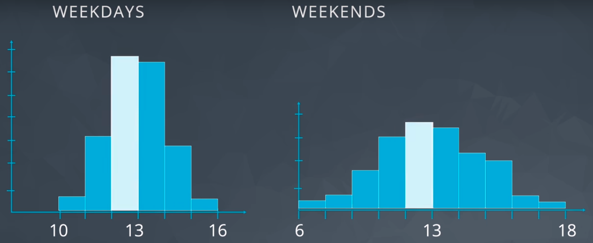
</p>

-  **So the number of dogs I expect to see are essentially the same for weekdays as on weekends. And the measures of center were the same on both have a mean, median, and mode that are about 13 dogs.**
<p align="center">
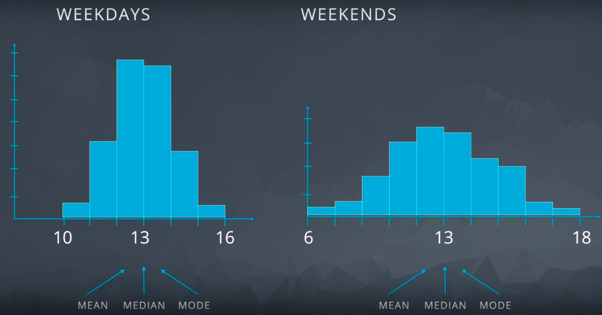
</p>

- **But something is different about these two distributions. So what's the difference? Well, the difference is how spread out the data are for each group. You can see that the number of dogs I see on weekdays, ranges from 10-16. While on weekends, it ranges from 6-18.**
<p align="center">
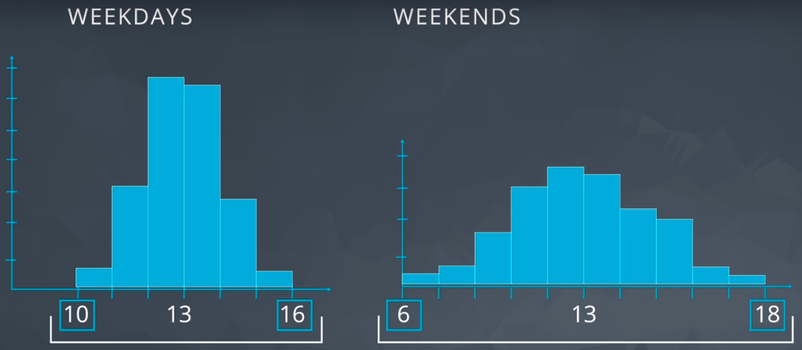
</p>

---

# ```Five Number Summary```

---

<p align="center">
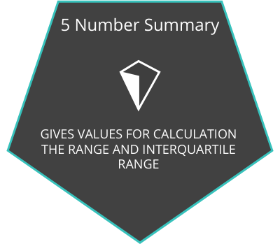
</p>

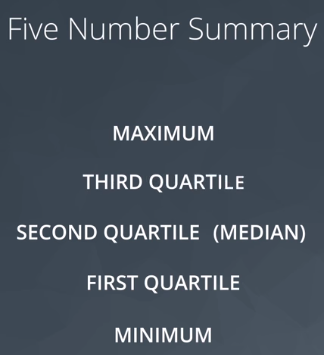


1. **Minimum:** The smallest number in the dataset.

2. **Q1:** The value such that 25% of the data fall below.

3. **Q2:** The value such that 50% of the data fall below.

4. **Q3:** The value such that 75% of the data fall below.

5. **Maximum:** The largest value in the dataset.

## **For Examples:-**

<p style="text-align:center"><strong>When n is Odd number</strong></p>
---

- **First we need to order the data to calculate Five Number summary**
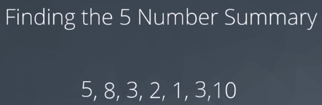
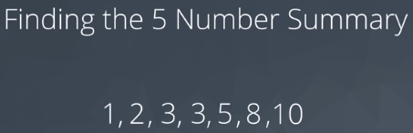

<br>
<br>
<br>

- **the minimum and the maximum values are easy to identify as the smallest and largest values. As we calculate it in the section on measures of center, the median is the middle value in our dataset.**
<p align="center">
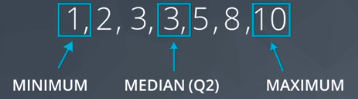
</p>

- **We also call this Q2 or the second quartile because 50% of our data or two quarters fall below this value.**
<p align="center">
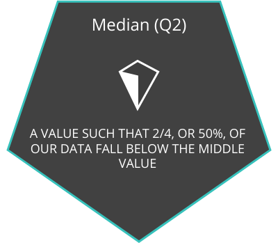
</p>

- **The remaining two values to complete the Five Number Summary are Q1 and Q3.**
<p align="center">
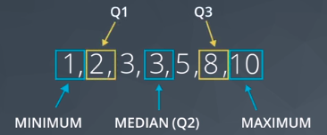
</p>

- **These values can be thought of as the medians of the data on either side of Q2**
<p align="center">

</p>

- **That is the median of these data points is Q1, this value is such that 25% of our data fall below it.**

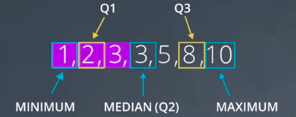
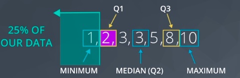
<br>
<br>
<br>
<br>
<br>

- **the median of these data points is Q3 or the third quartile, This value is such that 75% of our data fall below this mark.**

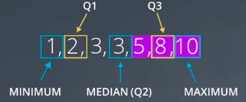
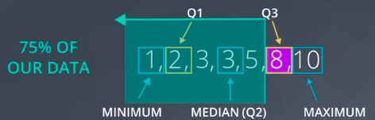
<br>
<br>
<br>
<br>
<br>

- **Notice, Q2 was not an either a set of these points used to calculate Q1 or Q3.**
<p align="center">
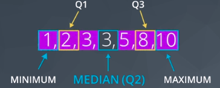
</p>

- **This provides our Five Number Summary as the following.**
<p align="center">
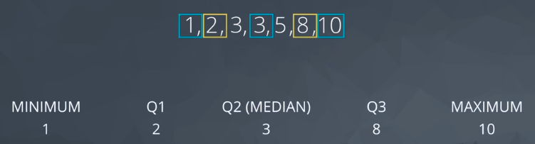
</p>

<p style="text-align:center"><strong>When n is Even number</strong></p>

---

- **First we need to order the data to calculate Five Number summary**
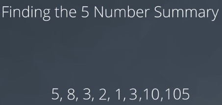
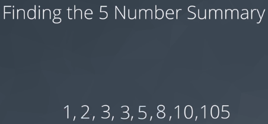

<br>
<br>
<br>
<br>

- **We can quickly identify the maximum and the minimum. Remember, with an even number of values, the median or Q2 is given as the mean of these two values here.**
<p align="center">
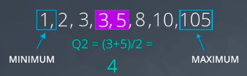
</p>

- **In order to find Q1 and Q3, we divide our dataset between the two values we use to find the median. This provides these two datasets.**
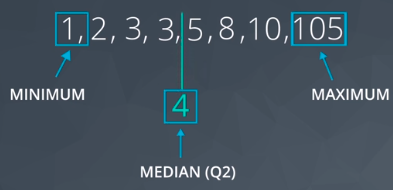
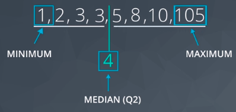

<br>
<br>
<br>
<br>

- **Finding the median of each of these will provide Q1 and Q3. For this dataset, Q1 will be the mean of these two values.**
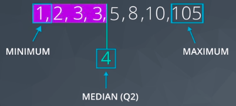
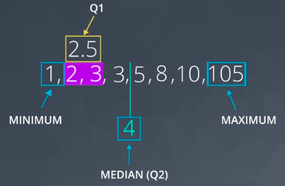

<br>
<br>
<br>
<br>
<br>
<br>

- **Q3, will be the mean of these two values.**
<p align="center">
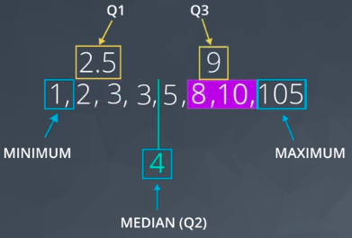
</p>

- **This provides our Five Number Summary as the following.**
- **Q3, will be the mean of these two values.**
<p align="center">
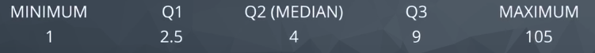
</p>


- **Range:
The <u>range</u> is then calculated as the difference between the <u>maximum</u> and the <u>minimum</u>.**

- **IQR:
The <u>interquartile</u> range is calculated as the difference between $\bold{Q_3}$ and $\bold{Q_1}$.**

- **Once we've calculated all the values for the Five Number Summary, finding the range and interquartile range is no problem. For the first dataset, the range is calculated as the maximum minus the minimum. For the first dataset, this was 10 minus 1 or 9. And the interquartile range is calculated as Q3 minus Q1, which is 8 minus 2 or 6.**
<p align="center">
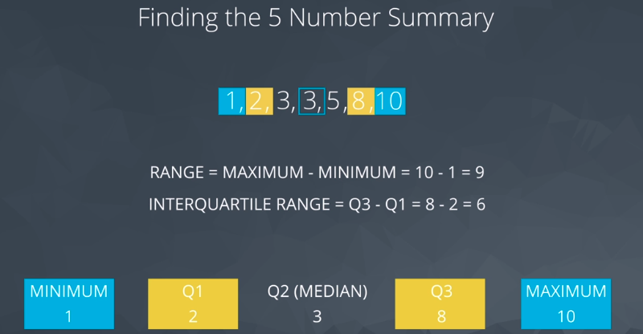
</p>

---

# ```Box Plot```

---

<p align="center">
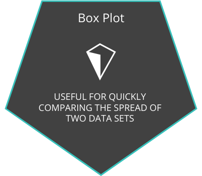
</p>

## **For Example:-**

- **We can quickly see that the number of dogs I see on weekends varies much more than the number of dogs I see on weekdays.**
<p align="center">
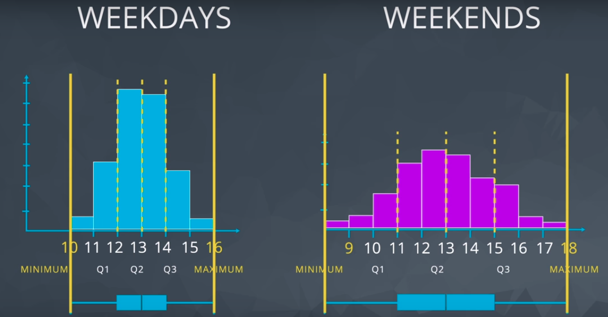
</p>

- **We can also visualize the distance from here to here as the <u>range</u>**
<p align="center">
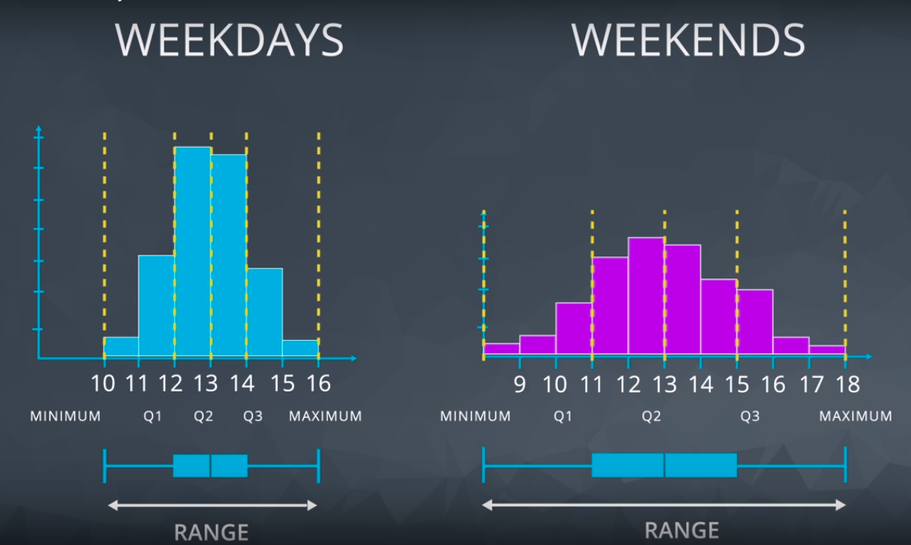
</p>

- **While the distance from here to here is the <u>interquartile range</u>**
<p align="center">
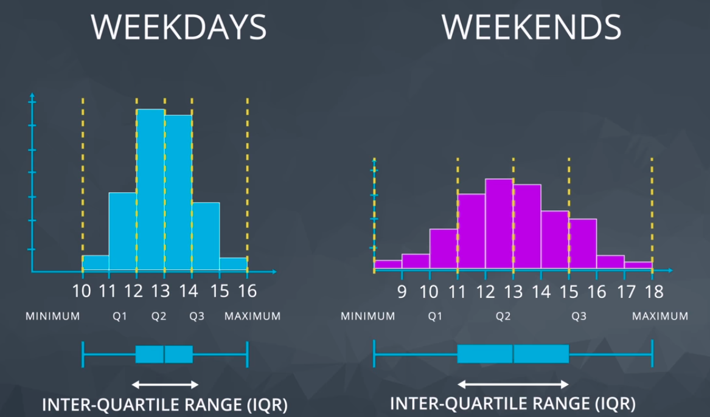
</p>

---

# ```Standard Deviation and Variance```

---

- ### **The <u>standard deviation</u> is one of the most common measures for talking about the spread of data. It is defined as <u>the average distance of each observation from the mean</u>.**
<p align="center">

</p>

## **For Example:-**

- **Imagine we wanted to know how far employees were located from their place of work. One person might be 15 miles, another 35, another only one mile, and another might be remote and is 103 miles. We could aggregate all of these distances together to show that the average distance employees are located from their work is 18 miles.**
<p align="center">
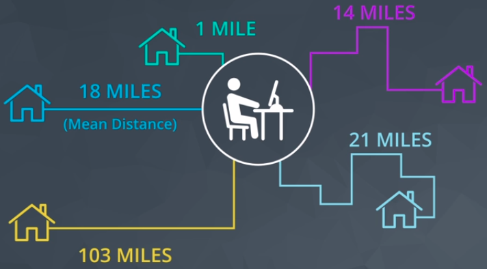
</p>

- **we want to know how the distance to work varies from one employee to the next. We could use the five number summary as a description. But if we wanted just one number to talk about the spread, we'd probably choose the standard deviation. For this example this is, how much on average the distance each person is from work differs from the average distance all of them are from work. So, this one is three miles farther from work than the average while this individual is four miles closer to work than the average.**

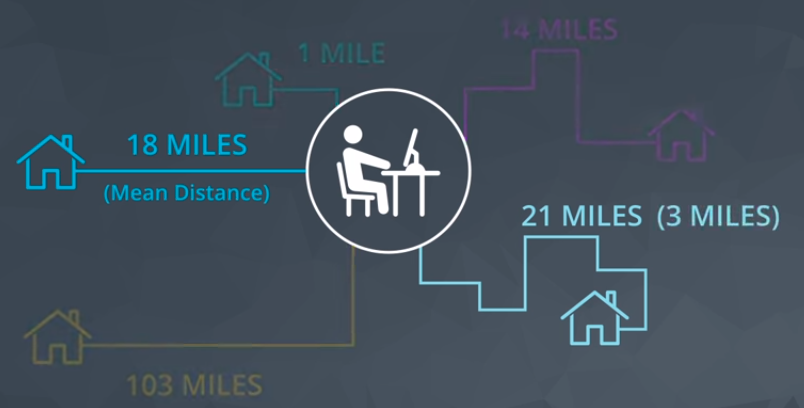
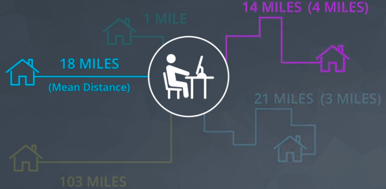

<br>
<br>
<br>
<br>
<br>
<br>

- **The standard deviation is how far on average are individuals located from this mean distance. So, it is like the average of all of these distances.**
<p align="center">
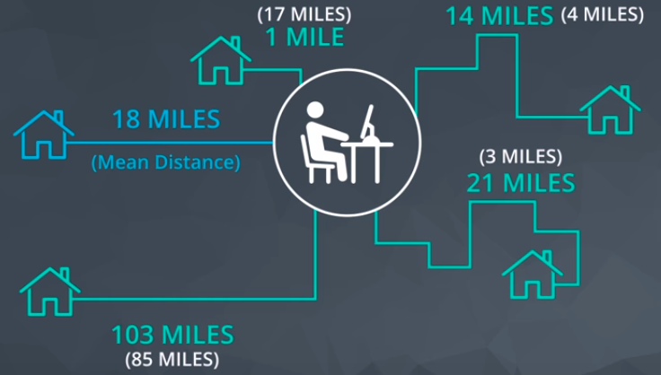
</p>

---

# ```Standard Deviation Calculation```

---

- **Imagine we have a data set with four values, 10, 14, 10, and 6.**
<p align="center">

</p>

- **The first thing we need to do to calculate the standard deviation is to find the mean. In notation, we have this as X bar. For our values, the sum is 40, and we have four numbers. So the mean is 40 over 4 or 10.**
<p align="center">

</p>

- **Then we want to look at the distance of each observation from this mean. Two of these observations are exactly equal to the mean. So the distance here is zero. One is 4 larger the 14, while the other is 4 smaller the 6.**

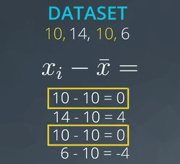

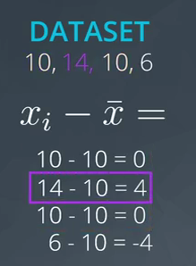

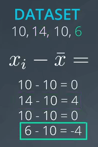

<br>
<br>
<br>
<br>
<br>
<br>
<br>
<br>
<br>
<br>

- **In notation, each of these is XI minus X bar. Then, if we were to average these distances, the positive would cancel with the negative value. And the value of zero isn't a great measure of the spread here. Zero would suggest that all the values are the same or that there's no spread.**
<p align="center">
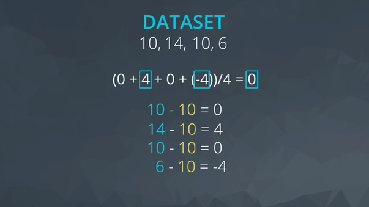
</p>

- **So instead, we need to make all of these values positive. The way we do this when calculating the standard deviation is by squaring them all. If we do that here, our negative and positive 4 values will become 16s.**
<p align="center">
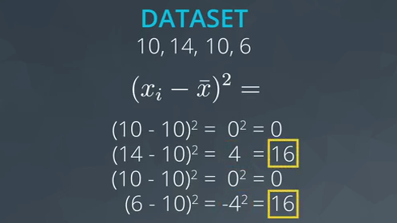
</p>

- **Now, we could average these to find the average squared distance of each observation from the mean. This is called the variance. Finding the average, just as we did before, means adding all of these values and dividing by how many there are. In our case, we had 0, 16, 0, 16 and we divide by 4 because we have four observations.**
<p align="center">
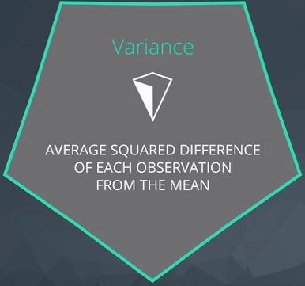
</p>
<p align="center">
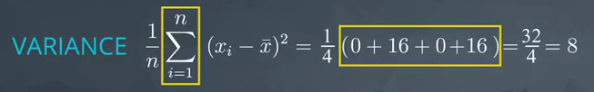
</p>

- **However, this is an average of squared values which we only did to get positive values in the first place. So to get our standard deviation, we take the square root of this ending value. Here, our standard deviation is 2.83.**
<p align="center">
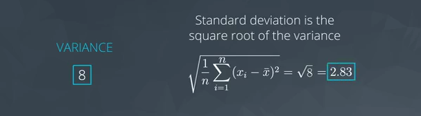
</p>

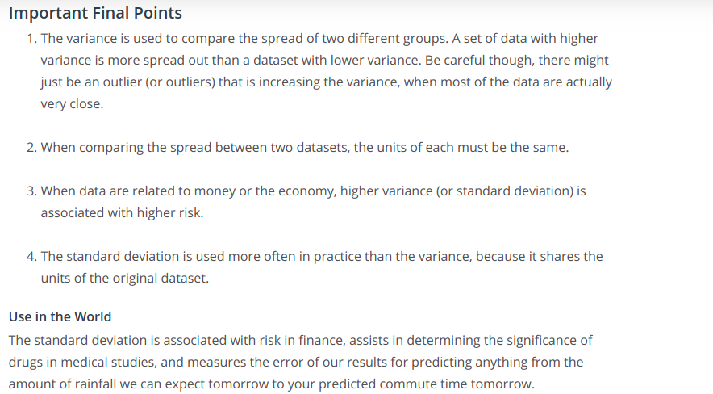

---

# ```Measures of Center and Spread Summary```

---

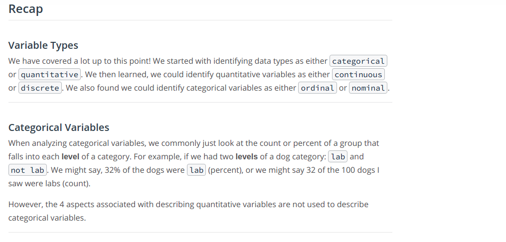
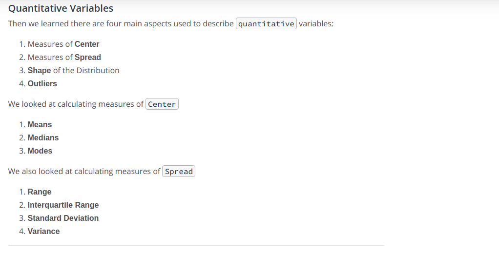
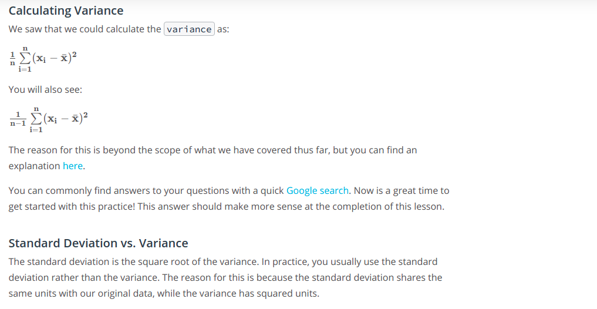

---

# ```Shape```

---

<p align="center">
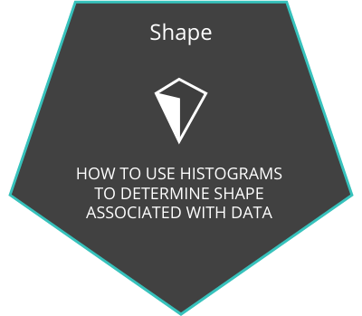
</p>

## **Symmetric Shape:-**

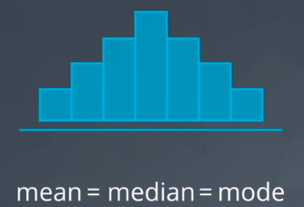

- **It also called Normal Distribution"The Bill Curve", when the data be in that shape (mean=median=mode) and the mode is the tallest bar in the histogram.**

<br>
<br>

## **Right Skewed Shape:-**
<p align="center">
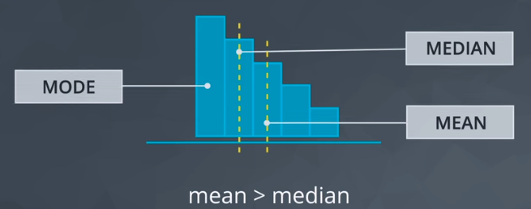
</p>

- **The data longed to the right and the median close to the mode and after the median is the mean, mean > median.**

## **Left Skewed Shape:-**
<p align="center">

</p>

- **The data longed to the left and the median close to the mode and after the median is the mean, mean < median.**

## **Relate the shapes to the 5 Number summary:-**

- **In order to relate this to the visual of a histogram,
back to the five number summary, here are the corresponding box plots below each histogram. Notice how the whiskers stretch in the direction of the skew, for each of the skewed distributions. That is the longer whisker is on the left, for a left skewed distribution and it's on the right, for the right skewed distribution.**
<p align="center">
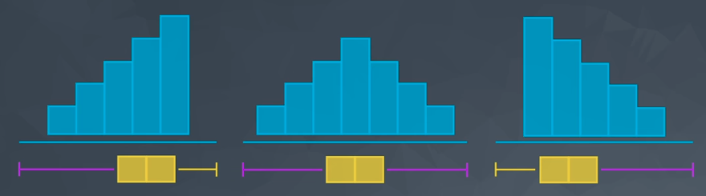
</p>

---

# ```The Shape For Data In The World```

---

<p align="center">
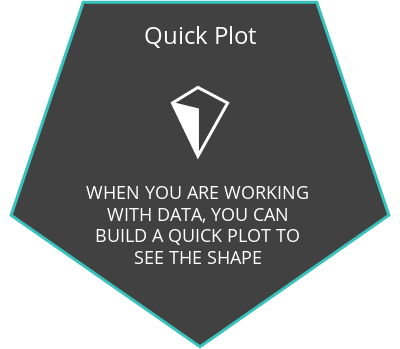
</p>

## **Some Examples of Bell Shaped Data:-**

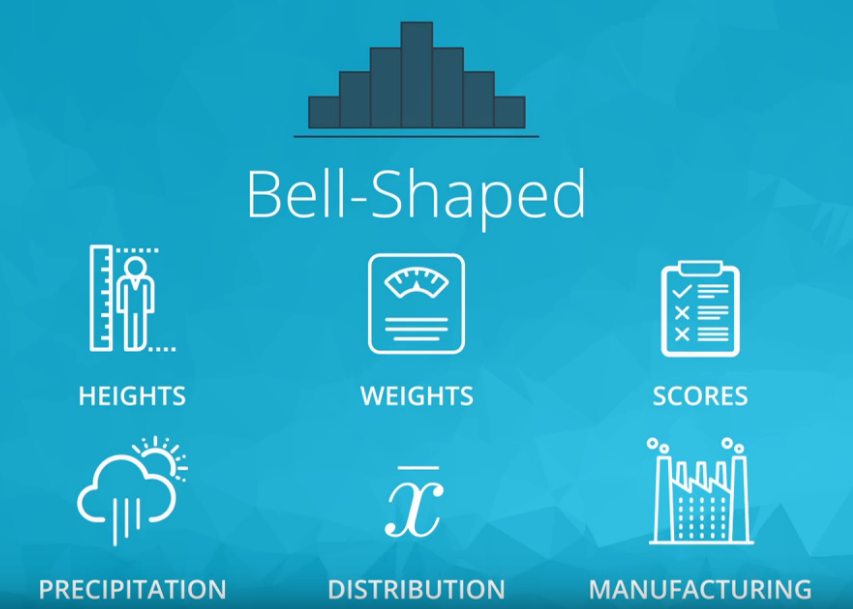

- **Heights**

<br>

- **Weights**

<br>

- **Scores**

<br>

- **Precipitation**

<br>

- **Distribution**

<br>

- **Manufacturing**

<br>

## **Examples Which Follow Left Skewed Shape:-**

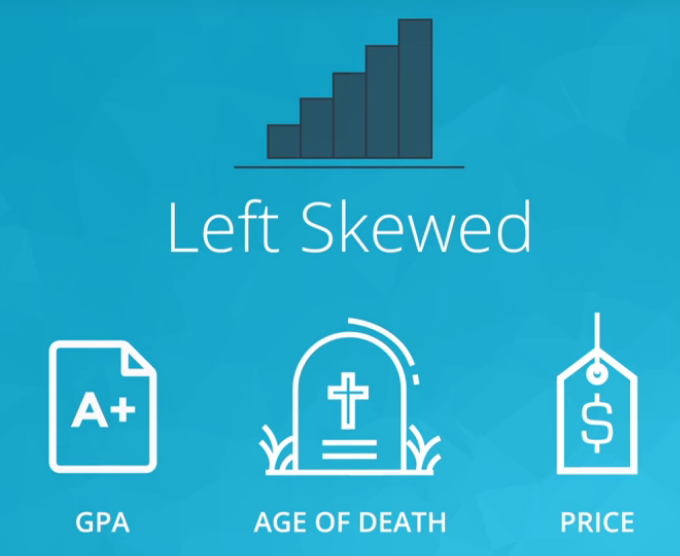

- **GPA**
<br>
<br>

- **Age OF Death**

<br>
<br>

- **Price**

<br>
<br>

## **Examples Which Follow Right Skewed Shape:-**

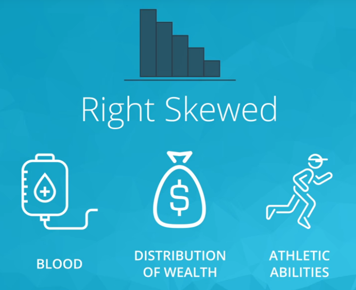

- **Blood**
<br>
<br>

- **Distribution OF Wealth**

<br>
<br>

- **Athletic Abilities**

<br>
<br>

---

#```Shape and Outliers```

---

<p align="center">
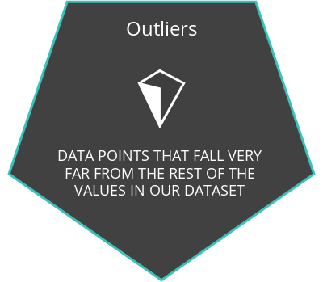
</p>

- **<u>outliers</u> are points that fall very far from the rest of our data points. This influences measures like the mean and standard deviation much more than measures associated with the five number summary.**

## **How to detect outliers:-**

- **We could use <u>Histogram</u> to detect it.**
<p align="center">
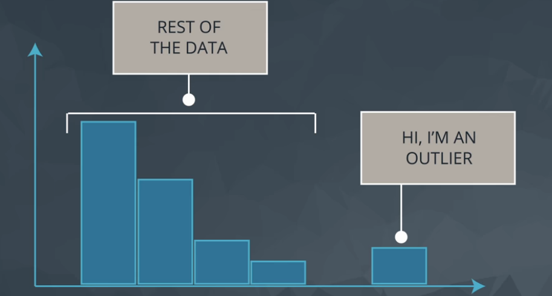
</p>

## **Effect of Outliers on five numbers summary:-**

- **let's consider the salaries of entrepreneurs. Imagine I select ten entrepreneur earnings and I pull these nine values here as earnings in thousands of dollars, and the tenth is the CEO of Facebook.**
<p align="center">
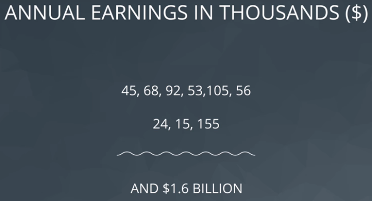
</p>

- **we can calculate the mean of these salaries for entrepreneurs based on this data to be approximately 160 million dollars. This is incredibly misleading. Literally zero of the entrepreneurs earned this salary. None of the ten salaries are even close to this amount.**
<p align="center">
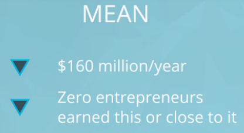
</p>

- **A better measure of center would certainly be the median. The median here is calculated at 62,000 dollars a year and is a better indication of what an entrepreneur is likely to earn based on our data.**
<p align="center">

</p>

- **Our standard deviation is also not a great measure in this case. At approximately 482 million dollars, all this suggests is that our earnings for entrepreneurs are really spread out, but that really isn't fair either. Just one point is really far from the rest. Like really really far.**
<p align="center">
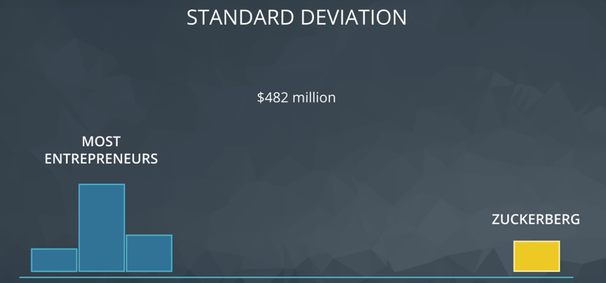
</p>

---

# ```Working With Outliers```

---


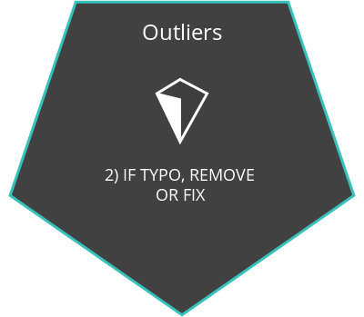

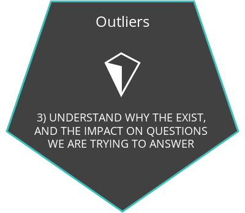
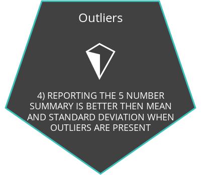

<p align="center">

</p>

## **Other Advices:-**
1.  
<p align="center">

</p>

2. 
<p align="center">

</p>

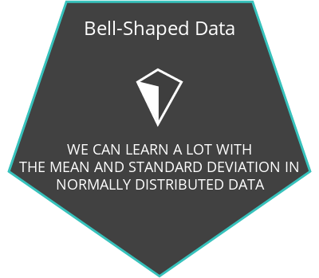

3. **If no outliers and your data follow a normal distribution - use the mean and standard deviation to describe your dataset, and report that the data are normally distributed.**

<br>
<br>

4. 
<p align="center">
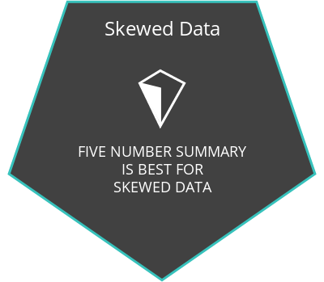
</p>

---

# ```Descriptive vs. Inferential Statistics```

---

### **Descriptive Statistics:-**
<p align="center">
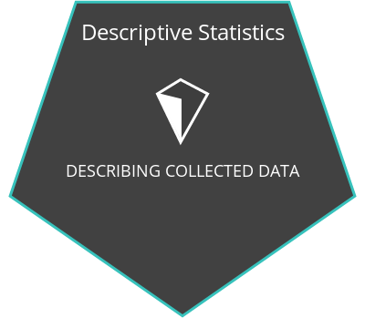
</p>

### **Inferential Statistics:-**
<p align="center">

</p>

### **Example:-**

- **what proportion of all Udacity students drink coffee. in order to get projects in on time, assume that you almost drink a ton of coffee.**
<p align="center">

</p>

- **I send out an email to all Udacity alumni and current students asking the question, do you drink coffee?**
<p align="center">

</p>

- **let's say the list contained 100,000 emails. Unfortunately, not everyone responds to my email blast. Some of the emails don't even go through. Therefore, I only receive 5,000 responses. I find that 73% of the individuals that responded to my email blast, say they do drink coffee.**
<p align="center">
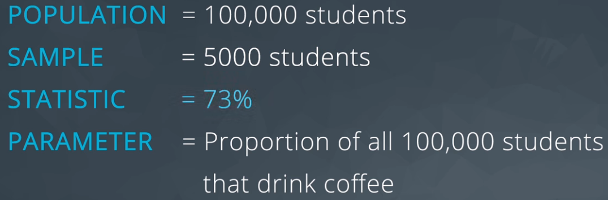
</p>

- **Descriptive statistics is about describing the data we have. That is, any information we have and share regarding the 5,000 responses is descriptive.**
<p align="center">

</p>

- **Inferential statistics is about drawing conclusions regarding the coffee drinking habits of all Udacity students, only using the data from the 5,000 responses.**
<p align="center">
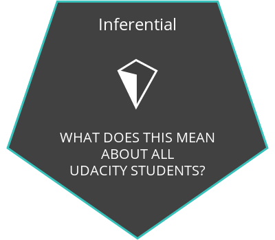
</p>

- **The general language associated with this scenario is as shown here. We have a population which is our entire group of interest. In our case, the 100,000 students. We collect a subset from this population which we call a sample. In our case, the 5,000 students. Any numeric summary calculated from the sample is called a statistic. In our case, the 73% of the 5,000 that drink coffee. This 73% is the statistic. A numeric summary of the population is known as a parameter. In our case, we don't know this value as it's a number that requires information from all Udacity students.**
<p align="center">

</p>
