> # **Introduction to Aggregation:-**

---

<p align="center">

</p>

**If you're familiar with Excel, SQL commands are pretty similar.**

* **Count, counts how many rows are in a particular column.**
<p align="center">
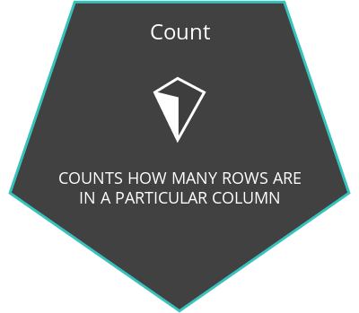
</p>

* **Sum, adds together all the values in a particular column.**
<p align="center">

</p>

* **Min and Max, return the lowest and highest values in a particular column.**
<p align="center">

</p>

* **Average, calculates the average of all the values in a particular column.**
<p align="center">
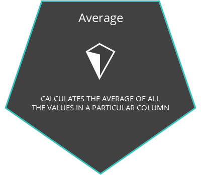
</p>

**__ These functions operate down columns, not across rows. So you can do things like sum up all the quantities of paper ever delivered. Instead of getting results set many thousands of rows long,you just get one line with the  answer. In practice, you'll find yourself using row-level output for the early exploratory work when searching your database to better understand the data. As you get a sense for what the data looks like and begin to look for answers to your questions, aggregates become more helpful. __**

> # **Introduction to NULLs:-**

---

**NULLs are a datatype that specifies where no data exists in SQL. They are often ignored in our aggregation functions**
<p align="center">

</p>

**__ It's different from a zero or a space. And there's a good reason. From a business perspective, for Parch & Posey a zero means that no paper was sold, which could mean that a sale was attempted but not made. A null could mean no sale was even attempted. And that's a pretty meaningful difference. __**

**Illustration:-**
---

1. - **To get a feel for how nulls work, let's pull a set of records from the accounts table with IDs that fall between 1500 and 1600. We can see that the primary POC, which stands for Point Of Contact, is blank for the Intel account. This could simply be an error in the data. Maybe a point of contact that was accidentally deleted at some point, or it could be that Parch & Posey's point of contact left the company and they don't yet have a new point of contact for that account. Either way, there is no data in this particular cell. This cell is null.**

```sql
    SELECT *
    FROM demo.accounts
    WHERE id > 1500 AND id < 1600
```

<p align="center">
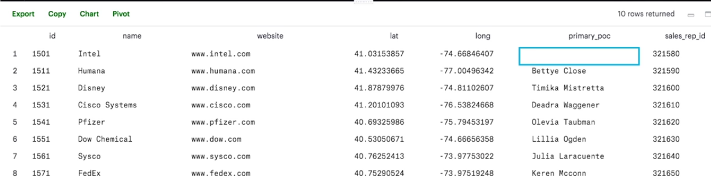
</p>

2. - **Imagining yourself as a sales manager at Parch & Posey, you may want to know all of the accounts for which the primary POC is null. If you don't have a point of contact, chances are you're not going to be able to keep that customer for much longer. In order to find all these accounts, we'll have to use some special syntax in our WHERE clause. Turns out, there are quite a few accounts without points of contact. So, the special thing about nulls that you need to write IS NULL instead of EQUALS NULL.**

```sql
    SELECT *
    FROM demo.accounts
    WHERE primary_poc IS NULL
```

<p align="center">

</p>

3. - **The reason this doesn't work is that NULL is not a value, it's a property of the data. This is different from zero or a space, both of which are values.**

```sql
    SELECT *
    FROM demo.accounts
    WHERE primary_poc = NULL
```

<p align="center">

</p>

4. - **If you want to find the inverse of our previous result set, you can use this syntax, IS NOT NULL. As you can see, this returns all rows for which there are values in the primary_POC column.**

```sql
    SELECT *
    FROM demo.accounts
    WHERE primary_poc IS NOT NULL
```

<p align="center">

</p>

**NULLs - Expert Tip**
---
- **<u>NULLs</u> frequently occur when performing a <u>LEFT</u> or <u>RIGHT</u> JOIN. You saw in the last lesson - when some rows in the left table of a left join are not matched with rows in the right table, those rows will contain some <u>NULL</u> values in the result set.**
<br>
- **<u>NULL</u>s can also occur from simply missing data in our database.**

> # **Count:-**

---

**COUNT the Number of Rows in a Table**

**Illustration:-**
---

1. - **finding all the rows in the accounts table.**

```sql
    SELECT COUNT(*)
    FROM accounts;
```

2. - **But we could have just as easily chosen a column to drop into the aggregation function:**

```sql
    SELECT COUNT(accounts.id)
    FROM accounts;
```
**These two statements are equivalent, but this isn't always the case.**

3. - **The count function can also be used to count the number of non-null records in an individual column. To illustrate this, let's take a look at the accounts table. As you can see, there are 354 rows in the accounts table.**

```sql
    SELECT COUNT(*) AS account_count
    FROM demo.accounts
```

<p align="center">
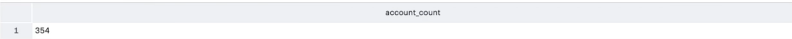
</p>

4. -  **Now, by substituting ID for the star, we can see how many non-null records there are in the ID column. Let's give the column a more sensible name while we're at it. Since there are no null values in the ID column, it returns the same result as count star.**

```sql
    SELECT COUNT(id) AS account_count
    FROM demo.accounts
```

<p align="center">
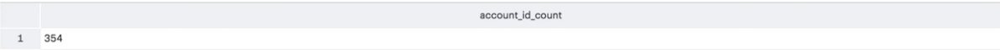
</p>

5. - **Now, let's try this with a column that we know contains some null values, primary poc. This time, we get a result that is nine lower than our previous result.**

```sql
    SELECT COUNT(primary_poc) AS account_primary_poc_count
    FROM demo.accounts
```

<p align="center">
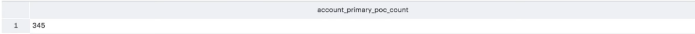
</p>

6. - **Let's run a quick query to verify that there are nine null values in the primary poc column. And here they are, the nine rows with null values. One thing you may have noticed is that count can be used in columns with non numerical values. This is not true of all aggregation functions, but it makes sense. The count function is just looking for non-null data and text is not null. Some of the functions we're about to learn like sum and average are impossible to apply to text because, well, how do you take the average of a bunch of account names.**

```sql
    SELECT *
    FROM demo.accounts
    WHERE primary_poc IS NULL
```

<p align="center">
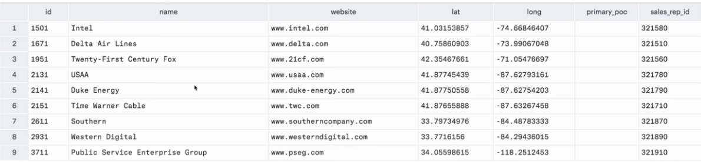
</p>

**Pro Tips:-**
---
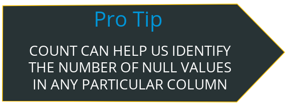
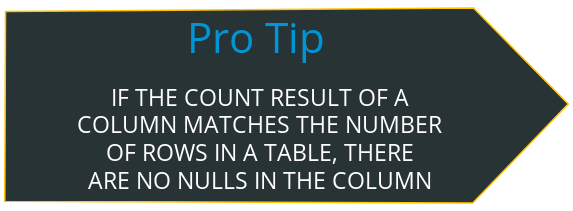


<br>
<br>
<br>
<br>
<br>
<br>
<br>
<br>
<br>
<br>
<br>

> # **SUM:-**

---

- **Imagine yourself as an operations manager at Parch & Posey. You're trying to do some inventory planning, and you want to know how much of each paper type to produce. A good place to start might be to total up all sales of each paper type and compare them to one another. We'll do this using <u>SUM</u>. It works similarly to <u>COUNT</u>, except that you'll want to specify column names rather than using star. It looks like standard is more popular than both of the non-standard paper types combined. Unlike <u>COUNT</u>, you can only use the <u>SUM</u> function on columns containing numerical values. You don't need to worry too much about the presence of nulls. The <u>SUM</u> function will just treat nulls as zero.**

```sql
    SELECT SUM(standard_qty) AS standard,
           SUM(gloss_qty) AS gloss,
           SUM(poster_qty) AS poster
    FROM demo.orders
```

<p align="center">

</p>

**Pro Tips:-**
---


<p align="center">

</p>

> # **MIN & MAX:-**

---

- **The syntax for <u>MIN</u> and <u>MAX</u> is similar to <u>SUM</u> and <u>COUNT</u>. It shouldn't be surprising that the minimum for each paper type is zero. Some customers only order one or two types of paper. What is surprising is that the largest single order is for poster paper, despite the fact that it's the least popular overall.**

```sql
    SELECT MIN(standard_qty) AS standard_min,
           MIN(gloss_qty) AS gloss_min,
           MIN(poster_qty) AS poster_min,
           MAX(standard_qty) AS standard_max,
           MAX(gloss_qty) AS gloss_max,
           Max(poster_qty) AS poster_max
        FROM demo.orders
```

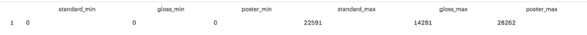

**Expert Tip:-**
---
- **Functionally, <u>MIN</u> and <u>MAX</u> are similar to <u>COUNT</u> in that they can be used on non-numerical columns. Depending on the column type, <u>MIN</u> will return the lowest number, earliest date, or non-numerical value as early in the alphabet as possible. As you might suspect, <u>MAX</u> does the opposite—it returns the highest number, the latest date, or the non-numerical value closest alphabetically to “Z”.**

> # **AVG:-**

---

- **So now we know which paper types are most popular and we have a sense of the largest order size we might need to fulfill at any given time. But what's the average order size? What can we expect to see on a regular basis? We'll use the average function which is typed as AVG and has a similar syntax to all of the other aggregation functions.**

```sql
    SELECT  AVG(standard_qty) AS standard_avg,
            AVG(gloss_qty) AS gloss_avg,
            AVG(poster_qty) AS poster_avg
    FROM demo.orders
```

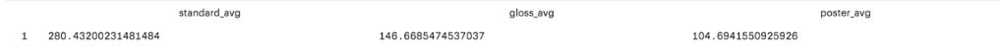

- **So it looks like that large poster paper order must have been a major outlier because the average poster order is only about a third the size of the average standard order. When you're using the average function, keep in mind that it can only be used on numerical columns. Also, it ignores nulls completely, meaning that rows with null values are not counted in the numerator or the denominator when calculating the average.**

**MEDIAN Expert Tip:-**
---

- **One quick note that a median might be a more appropriate measure of center for this data, but finding the median happens to be a pretty difficult thing to get using SQL alone — so difficult that finding a median is occasionally asked as an interview question.**

```sql
    SELECT *
    FROM (SELECT total_amt_usd
          FROM orders
          ORDER BY total_amt_usd
          LIMIT 3457) AS table1
    ORDER BY total_amt_usd DESC
```

> # **GROUP BY:-**

---

- **<u>GROUP BY</u> can be used to aggregate data within subsets of the data. For example, grouping for different accounts, different regions, or different sales representatives.**
<p align="center">

</p>

**Illustration:-**
---

1. - **we want to create a separate set of sums for each account id. So, let's add the account id column into our Select statement. As you can see, this returns an error.**
  
```sql
    SELECT account_id,
           SUM(standard_qty) AS standard_sum,
           SUM(gloss_qty) AS gloss_sum,
           SUM(poster_qty) AS poster_sum
    FROM   demo.orders
```

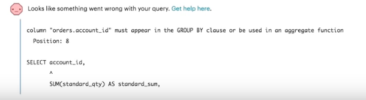

2. - **As we aggregate in this query, we're effectively collapsing the number of rows returned. In our previous query, we collapsed all the way down to a single row. The reason we're getting an error here, is that we've included the account id column but this column isn't being collapsed like the columns that are being aggregated. The query isn't sure whether to sum the account id as well or whether to make it into a grouping. We have to be explicit about this. We want to tell the query to aggregate into segments where each segment is one of the values in the account id column. We'll do this using the <u>GROUP BY</u> clause.**
  
```sql
    SELECT account_id,
           SUM(standard_qty) AS standard_sum,
           SUM(gloss_qty) AS gloss_sum,
           SUM(poster_qty) AS poster_sum
    FROM   demo.orders
    GROUP BY account_id
```

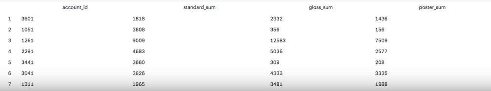

3. - **You can see that this isn't ordered intuitively, so let's fix that. The <u>GROUP BY</u> clause always goes between the <u>WHERE</u> clause if there is one and the <u>ORDER BY</u> clause. Whenever there's a field in the Select statement that's not being aggregated, the query expects it to be in the <u>GROUP BY</u> clause. A column that's not aggregated and not in the <u>GROUP BY</u> will return the error we saw before. This is pretty important and it's the key to correctly using <u>GROUP BY</u> statements.**

```sql
    SELECT account_id,
           SUM(standard_qty) AS standard_sum,
           SUM(gloss_qty) AS gloss_sum,
           SUM(poster_qty) AS poster_sum
    FROM   demo.orders
    GROUP BY account_id
    ORDER BY account_id
```


**Expert Tip:-**
---

- **Before we dive deeper into aggregations using <u>GROUP BY</u> statements, it is worth noting that SQL evaluates the aggregations before the <u>LIMIT</u> clause. If you don’t group by any columns, you’ll get a 1-row result—no problem there. If you group by a column with enough unique values that it exceeds the <u>LIMIT</u> number, the aggregates will be calculated, and then some rows will simply be omitted from the results.**

<br>

- **The <u>GROUP BY</u> always goes between <u>WHERE</u> and <u>ORDER BY</u>.**

<br>

- **<u>ORDER BY</u> works like <u>SORT</u> in spreadsheet software.**

**Example:-**
---

1. **Which account (by name) placed the earliest order? Your solution should have the account name and the date of the order.**

```sql
    SELECT a.name, o.occurred_at
    FROM accounts a
    JOIN orders o
    ON a.id = o.account_id
    ORDER BY occurred_at
    LIMIT 1;
```

2. **Find the total sales in usd for each account. You should include two columns - the total sales for each company's orders in usd and the company name.**

```sql
    SELECT a.name, SUM(total_amt_usd) total_sales
    FROM orders o
    JOIN accounts a
    ON a.id = o.account_id
    GROUP BY a.name;
```

3. **Via what channel did the most recent (latest) web_event occur, which account was associated with this web_event? Your query should return only three values - the date, channel, and account name.**

```sql
    SELECT w.occurred_at, w.channel, a.name
    FROM web_events w
    JOIN accounts a
    ON w.account_id = a.id 
    ORDER BY w.occurred_at DESC
    LIMIT 1;
```

4. **Find the total number of times each type of channel from the web_events was used. Your final table should have two columns - the channel and the number of times the channel was used.**

```sql
    SELECT w.channel, COUNT(*)
    FROM web_events w
    GROUP BY w.channel
```

5. **Who was the primary contact associated with the earliest web_event?**

```sql
    SELECT a.primary_poc
    FROM web_events w
    JOIN accounts a
    ON a.id = w.account_id
    ORDER BY w.occurred_at
    LIMIT 1;
```

6. **What was the smallest order placed by each account in terms of total usd. Provide only two columns - the account name and the total usd. Order from smallest dollar amounts to largest.**

```sql
    SELECT a.name, MIN(total_amt_usd) smallest_order
    FROM accounts a
    JOIN orders o
    ON a.id = o.account_id
    GROUP BY a.name
    ORDER BY smallest_order;
```
**Sort of strange we have a bunch of orders with no dollars. We might want to look into those.**

7. **Find the number of sales reps in each region. Your final table should have two columns - the region and the number of sales_reps. Order from fewest reps to most reps.**

```sql
    SELECT r.name, COUNT(*) num_reps
    FROM region r
    JOIN sales_reps s
    ON r.id = s.region_id
    GROUP BY r.name
    ORDER BY num_reps;
```
---

- **If we want to segment our data into even more granular chunks, we can group by multiple columns. Imagine yourself as a marketing manager at Parch & Posey, trying to understand how each account interacted with various advertising channels.**
- **Which channels are driving traffic and leading to purchases?**
- **Are we investing in channels that aren't worth the cost?**
- **How much traffic are we obtaining from each channel?**
- **One way we might begin to look into these questions, is to count up all of the events for each channel, for each account ID.**

```sql
    SELECT account_id,
           channel,
           COUNT(id) AS events
    FROM demo.orders
    GROUP BY account_id, channel
    ORDER BY account_id, channel
```
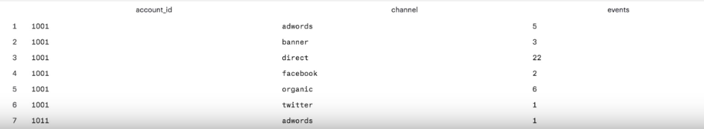

- **It looks like the really useful information here is in the events column. Let's reorder this to highlight the highest volume channels for each account.**

```sql
    SELECT account_id,
           channel,
           COUNT(id) AS events
    FROM demo.orders
    GROUP BY account_id, channel
    ORDER BY account_id, events DESC
```
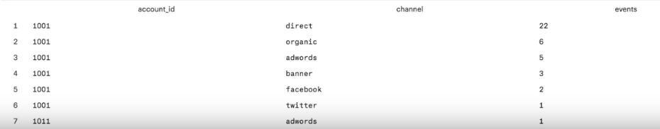

**Example:-**
---

1. **For each account, determine the average amount of each type of paper they purchased across their orders. Your result should have four columns - one for the account name and one for the average spent on each of the paper types.**

```sql
    SELECT a.name, AVG(o.standard_qty) avg_stand, AVG(o.gloss_qty) avg_gloss, AVG(o.poster_qty) avg_post
    FROM accounts a
    JOIN orders o
    ON a.id = o.account_id
    GROUP BY a.name;
```

2. **For each account, determine the average amount spent per order on each paper type. Your result should have four columns - one for the account name and one for the average amount spent on each paper type.**

```sql
    SELECT a.name, AVG(o.standard_amt_usd) avg_stand, AVG(o.gloss_amt_usd) avg_gloss, AVG(o.poster_amt_usd) avg_post
    FROM accounts a
    JOIN orders o
    ON a.id = o.account_id
    GROUP BY a.name;
```

3. **Determine the number of times a particular channel was used in the web_events table for each sales rep. Your final table should have three columns - the name of the sales rep, the channel, and the number of occurrences. Order your table with the highest number of occurrences first.**

```sql
    SELECT s.name, w.channel, COUNT(*) num_events
    FROM accounts a
    JOIN web_events w
    ON a.id = w.account_id
    JOIN sales_reps s
    ON s.id = a.sales_rep_id
    GROUP BY s.name, w.channel
    ORDER BY num_events DESC;
```

4. **Determine the number of times a particular channel was used in the web_events table for each region. Your final table should have three columns - the region name, the channel, and the number of occurrences. Order your table with the highest number of occurrences first.**

```sql
    SELECT r.name, w.channel, COUNT(*) num_events
    FROM accounts a
    JOIN web_events w
    ON a.id = w.account_id
    JOIN sales_reps s
    ON s.id = a.sales_rep_id
    JOIN region r
    ON r.id = s.region_id
    GROUP BY r.name, w.channel
    ORDER BY num_events DESC;
```

**GROUP BY - Expert Tips**
---

- **The order of column names in your <u>GROUP BY</u> clause doesn’t matter—the results will be the same regardless. If we run the same query and reverse the order in the <u>GROUP BY</u> clause, you can see we get the same results.**

<br>

- **As with <u>ORDER BY</u>, you can substitute numbers for column names in the <u>GROUP BY</u> clause. It’s generally recommended to do this only when you’re grouping many columns, or if something else is causing the text in the <u>GROUP BY</u> clause to be excessively long.**

<br>

- **A reminder here that any column that is not within an aggregation must show up in your <u>GROUP BY</u> statement. If you forget, you will likely get an error. However, in the off chance that your query does work, you might not like the results!**

> # **DISTINCT:-**

---

- **DISTINCT is always used in SELECT statements, and it provides the unique rows for all columns written in the SELECT statement. Therefore, you only use DISTINCT once in any particular SELECT statement.**

**Illustration:-**
---

1. - **let's revisit the count of events by channel by account we looked at in the GROUP BY segment. Notice the row count, 1509.**

```sql
    SELECT account_id,
           channel,
           COUNT(id) AS events
    FROM demo.web_events
    GROUP BY account_id, channel
    ORDER BY account_id, events DESC
```

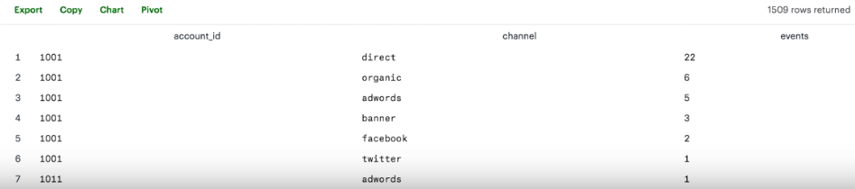

2. - **If we get rid of the events column, you can see that the resulting query returns basically the same results with the same row count.**

```sql
    SELECT account_id,
           channel
    FROM demo.web_events
    GROUP BY account_id, channel
    ORDER BY account_id
```

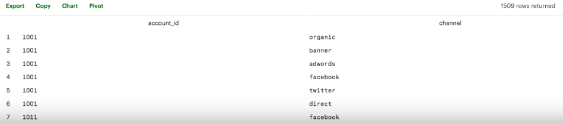

3. - **And if we run that query again with DISTINCT, you can see that the results are the same. Of course, they don't include the COUNT anymore because we've removed it from our select statement. Since it's no longer in our select statement, and since we're no longer doing an aggregation, we don't need the GROUP BY clause either.**

```sql
    SELECT DISTINCT account_id,
           channel
    FROM demo.web_events
    ORDER BY account_id
```

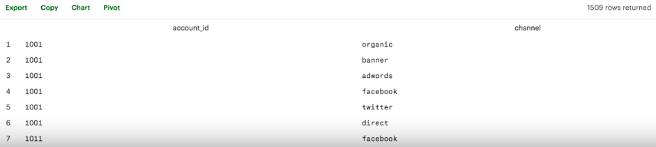

**DISTINCT - Expert Tip:-**
---

- **It’s worth noting that using <u>DISTINCT</u>, particularly in aggregations, can slow your queries down quite a bit.**

> # **HAVING:-**

---

- **The HAVING clause was added to SQL because the WHERE keyword could not be used with aggregate functions.**

**Illustration:-**
---

1. - **You might want to identify the total sales in US dollars for accounts with over $250,000 in sales, to better understand the proportion of revenue that comes from these large accounts. To get this list, let's first get the sum of sales for each account. We'll order them in descending order so that we can see all the highest value accounts at the top of the result set.**

```sql
    SELECT account_id,
           SUM(total_amt_usd) AS sum_total_amt_usd
    FROM orders
    GROUP BY 1
    ORDER BY 2 DESC
```

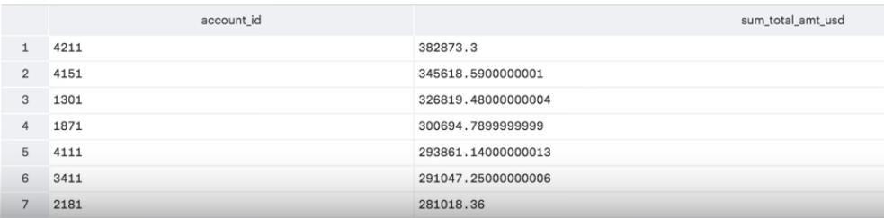

2. - **Now let's filter down to just the accounts with more than $250,000 in sales. You'll notice that the WHERE clause isn't exactly built for this. The WHERE clause won't work for this because it doesn't allow you to filter on aggregate columns.**

```sql
    SELECT account_id,
           SUM(total_amt_usd) AS sum_total_amt_usd
    FROM orders
    WHERE SUM(total_amt_usd) >= 250000
    GROUP BY 1
    ORDER BY 2 DESC
```


3. - **That's where the HAVING clause comes in. This filters the query down to just the account IDs with more than $250,000 in total sales. One thing to keep in mind is that this is really only useful when grouping by one or more columns. If you're aggregating across the entire dataset, the output is only one line anyway, so there's no need to filter beyond that.**

```sql
    SELECT account_id,
           SUM(total_amt_usd) AS sum_total_amt_usd
    FROM orders
    GROUP BY 1
    HAVING SUM(total_amt_usd) >= 250000
```


**Examples:-**
---

1. **How many of the sales reps have more than 5 accounts that they manage?**

```sql
    SELECT s.id, s.name, COUNT(*) num_accounts
    FROM accounts a
    JOIN sales_reps s
    ON s.id = a.sales_rep_id
    GROUP BY s.id, s.name
    HAVING COUNT(*) > 5
    ORDER BY num_accounts;
```

**and technically, we can get this using a SUBQUERY as shown below. This same logic can be used for the other queries, but this will not be shown.**

```sql
    SELECT COUNT(*) num_reps_above5
    FROM(SELECT s.id, s.name, COUNT(*) num_accounts
     FROM accounts a
     JOIN sales_reps s
     ON s.id = a.sales_rep_id
     GROUP BY s.id, s.name
     HAVING COUNT(*) > 5
     ORDER BY num_accounts) AS Table1;
```

2. **How many accounts have more than 20 orders?**

```sql
    SELECT a.id, a.name, COUNT(*) num_orders
    FROM accounts a
    JOIN orders o
    ON a.id = o.account_id
    GROUP BY a.id, a.name
    HAVING COUNT(*) > 20
    ORDER BY num_orders;
```

3. **Which account has the most orders?**

```sql
    SELECT a.id, a.name, COUNT(*) num_orders
    FROM accounts a
    JOIN orders o
    ON a.id = o.account_id
    GROUP BY a.id, a.name
    ORDER BY num_orders DESC
    LIMIT 1;
```

4. **How many accounts spent more than 30,000 usd total across all orders?**

```sql
    SELECT a.id, a.name, SUM(o.total_amt_usd) total_spent
    FROM accounts a
    JOIN orders o
    ON a.id = o.account_id
    GROUP BY a.id, a.name
    HAVING SUM(o.total_amt_usd) > 30000
    ORDER BY total_spent;
```

5. **How many accounts spent less than 1,000 usd total across all orders?**

```sql
    SELECT a.id, a.name, SUM(o.total_amt_usd) total_spent
    FROM accounts a
    JOIN orders o
    ON a.id = o.account_id
    GROUP BY a.id, a.name
    HAVING SUM(o.total_amt_usd) < 1000
    ORDER BY total_spent;
```

6. **Which account has spent the most with us?**

```sql
    SELECT a.id, a.name, SUM(o.total_amt_usd) total_spent
    FROM accounts a
    JOIN orders o
    ON a.id = o.account_id
    GROUP BY a.id, a.name
    ORDER BY total_spent DESC
    LIMIT 1;
```

7. **Which account has spent the least with us?**

```sql
    SELECT a.id, a.name, SUM(o.total_amt_usd) total_spent
    FROM accounts a
    JOIN orders o
    ON a.id = o.account_id
    GROUP BY a.id, a.name
    ORDER BY total_spent
    LIMIT 1;
```

8. **Which accounts used facebook as a channel to contact customers more than 6 times?**

```sql
    SELECT a.id, a.name, w.channel, COUNT(*) use_of_channel
    FROM accounts a
    JOIN web_events w
    ON a.id = w.account_id
    GROUP BY a.id, a.name, w.channel
    HAVING COUNT(*) > 6 AND w.channel = 'facebook'
    ORDER BY use_of_channel;
```

9. **Which account used facebook most as a channel?**

```sql
    SELECT a.id, a.name, w.channel, COUNT(*) use_of_channel
    FROM accounts a
    JOIN web_events w
    ON a.id = w.account_id
    WHERE w.channel = 'facebook'
    GROUP BY a.id, a.name, w.channel
    ORDER BY use_of_channel DESC
    LIMIT 1;
```

**Note: This query above only works if there are no ties for the account that used facebook the most. It is a best practice to use a larger limit number first such as 3 or 5 to see if there are ties before using LIMIT 1.**

10. **Which channel was most frequently used by most accounts?**

```sql
    SELECT a.id, a.name, w.channel, COUNT(*) use_of_channel
    FROM accounts a
    JOIN web_events w
    ON a.id = w.account_id
    GROUP BY a.id, a.name, w.channel
    ORDER BY use_of_channel DESC
    LIMIT 10;
```

**All of the top 10 are direct.**

**HAVING - Expert Tip:-**
---

- **<u>HAVING</u> is the “clean” way to filter a query that has been aggregated, but this is also commonly done using a [subquery](https://community.modeanalytics.com/sql/tutorial/sql-subqueries/). Essentially, any time you want to perform a <u>WHERE</u> on an element of your query that was created by an aggregate, you need to use <u>HAVING</u> instead.**

> # **DATE Functions:-**

---

- **Aggregating by date fields, in particular, doesn't work in a practical way. It treats each time stamp is unique. When it would be more practical to round to the nearest day, week, or month, and aggregate across that period. Take for example, this sum of standard paper quantities by time period. You can see in the results here that this really isn't any more useful than looking at the raw data. This aggregates from six 6,912 rows in the raw data down to 6,908.**

```sql
    SELECT occurred_at,
           SUM(standard_qty) AS standard_qty_sum
    FROM orders
    GROUP BY occurred_at
    ORDER BY occurred_at
```


- **let's take a look at how dates are stored. If you live in the United States, you're probably used to seeing dates formatted as month-month, day-day, year-year-year-year, or similar month first format. see the most other places in the world follow a day-day, month-month, year-year-year-year, format. Databases do it yet another way. year-year-year-year, month-month, day-day.**

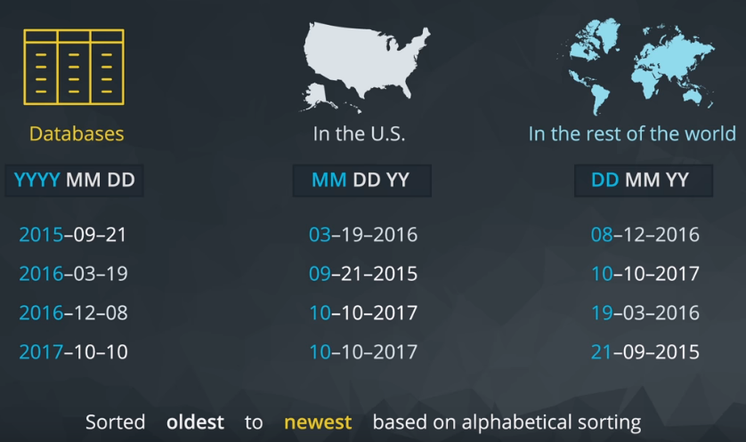

- **we can see that the year first way the databases store dates, is ideal for sorting the way we'll want to retrieve this information in the future. Whether we want the most recent or oldest information, day first and month first date formats sort of funny ways that don't make a ton of sense.**


- **Another benefit is the date can easily be truncated in order to group them for analysis. Take the date 2017- 04- 01 12:15:01. If we want to group that with other events that occurred on the same day, we can't do that with the date in its current format. Grouping now or group by every event that occurred on April 1st, at 12:15, and 1 second. That won't help us very much.**


- **In order to group by day, we'll need to adjust all the times on April 1st 2017 to read: 2017-04-01 00:00:00. That way when we group by date, we get every event that occurred for all hours, minutes, and seconds of April 1st. They'll all be grouped together into the same grouping.**


- **We can do this using the date trunc function. Let's start by grouping by occurred at without any truncation. As you can see, this doesn't help us much at all. If we replace each instance of occurred at with a truncated version, we'll get a result set that sums the quantities of standard paper by day. It's important to group by the same metric that's included in the select statement to assure your results are consistent. The easiest way to make sure you group correctly is to use column numbers instead of retyping the exact functions.**

```sql
    SELECT DATE_TRUNC('day', occurred_at) AS day,
           SUM(standard_qty) AS standard_qty_sum
    FROM orders
    GROUP BY 1
    ORDER BY 1
```


- **Date trunc can be used to aggregate at very granular levels like second. That might be useful if you're working with server logs or many events happen in a given second. Most of the time though, you'll use this to aggregate at intervals that make sense from a business perspective: day, week, month, quarter, and year. Here, we can see different truncations. Notice that if our month or day are 01, there's no change made to these values, as you can see.**

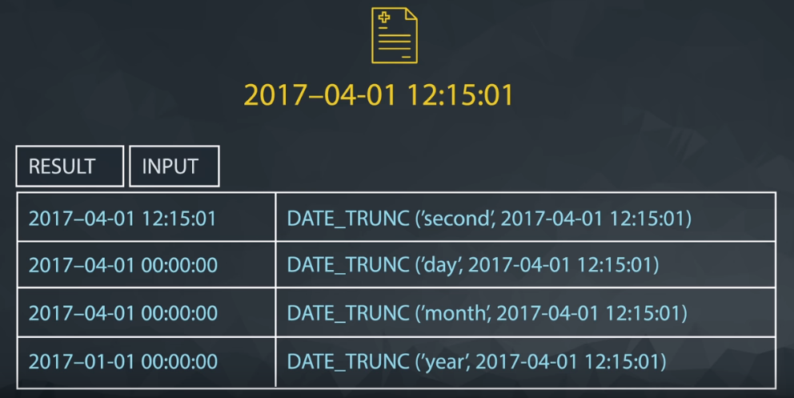

- **There are some cases where you might want to just pull out a given part of the day. For example, if you want to know what day of the week Parch & Posey's website sees the most traffic, you wouldn't want to use date trunc. To get the day of the week, you'd have to use date part. Date part allows you to pull the part of the date that you're interested in. But notice that regardless of year, a date part would provide the same month for an event that happens in April 2016 and April 2017 where a date trunc would differentiate these events.**

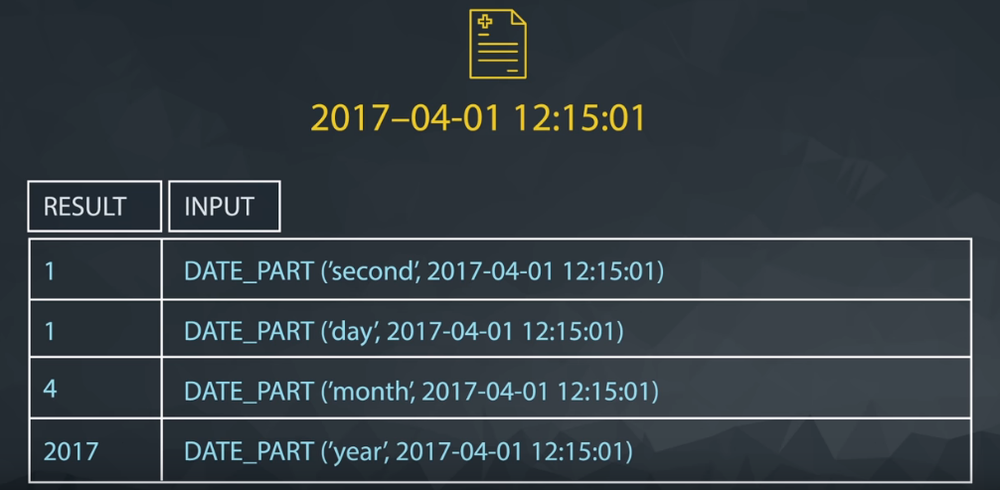

- **Let's explore this example using Parch & Posey's data. On what day of the week are the most sales made? Let's start by figuring out the day of the week for each one. DOW stands for day of week and returns a value from zero to six, where zero is Sunday and six is Saturday. Now that we have this column, we can aggregate to figure out the day with the most reams of paper sold. We'll order it by the sum in descending order so that the day with the most sales will be at the top of the result set. Looks like the most paper was ordered on Sunday and the least paper was ordered on Thursday.**

```sql
    SELECT DATE_PART('dow', occurred_at) AS day_of_week,
           SUM(total) AS total_qty
    FROM orders
    GROUP BY 1
    ORDER BY 2 DESC
```


**Examples:-**
---

1. **Find the sales in terms of total dollars for all orders in each year, ordered from greatest to least. Do you notice any trends in the yearly sales totals?**

```sql
    SELECT DATE_PART('year', occurred_at) ord_year,  SUM(total_amt_usd) total_spent
    FROM orders
    GROUP BY 1
    ORDER BY 2 DESC;
```

**When we look at the yearly totals, you might notice that 2013 and 2017 have much smaller totals than all other years. If we look further at the monthly data, we see that for 2013 and 2017 there is only one month of sales for each of these years (12 for 2013 and 1 for 2017). Therefore, neither of these are evenly represented. Sales have been increasing year over year, with 2016 being the largest sales to date. At this rate, we might expect 2017 to have the largest sales.**

2. **Which month did Parch & Posey have the greatest sales in terms of total dollars? Are all months evenly represented by the dataset?**

**In order for this to be 'fair', we should remove the sales from 2013 and 2017. For the same reasons as discussed above.**

```sql
    SELECT DATE_PART('month', occurred_at) ord_month, SUM(total_amt_usd) total_spent
    FROM orders
    WHERE occurred_at BETWEEN '2014-01-01' AND '2017-01-01'
    GROUP BY 1
    ORDER BY 2 DESC;
```

**The greatest sales amounts occur in December (12).**

3. **Which year did Parch & Posey have the greatest sales in terms of total number of orders? Are all years evenly represented by the dataset?**

```sql
    SELECT DATE_PART('year', occurred_at) ord_year,  COUNT(*) total_sales
    FROM orders
    GROUP BY 1
    ORDER BY 2 DESC;
```

**Again, 2016 by far has the most amount of orders, but again 2013 and 2017 are not evenly represented to the other years in the dataset.**

4. **Which month did Parch & Posey have the greatest sales in terms of total number of orders? Are all months evenly represented by the dataset?**

```sql
    SELECT DATE_PART('month', occurred_at) ord_month, COUNT(*) total_sales
    FROM orders
    WHERE occurred_at BETWEEN '2014-01-01' AND '2017-01-01'
    GROUP BY 1
    ORDER BY 2 DESC;
```

**December still has the most sales, but interestingly, November has the second most sales (but not the most dollar sales. To make a fair comparison from one month to another 2017 and 2013 data were removed.**

5. **In which month of which year did Walmart spend the most on gloss paper in terms of dollars?**

```sql
    SELECT DATE_TRUNC('month', o.occurred_at) ord_date, SUM(o.gloss_amt_usd) tot_spent
    FROM orders o 
    JOIN accounts a
    ON a.id = o.account_id
    WHERE a.name = 'Walmart'
    GROUP BY 1
    ORDER BY 2 DESC
    LIMIT 1;
```

**May 2016 was when Walmart spent the most on gloss paper.**

> # **CASE Statements:-**

---

1. - **You know Facebook is a great channel for your business but, is it better than all the rest combined? Let's find out. In order to do this, you'll need to create a derived column. That means you'll take data from existing columns and modify it.**

<p align=center>

</p>

2. - **the "CASE" statement which is SQL's way of handling "IF" "then" logic. The case statement is followed by at least one pair of "WHEN" and "THEN" statements. SQL's equivalent of "IF" "THEN". It must finish with the word "END". As you can see, the case statement checks each row to see if the conditional statement "channel equals Facebook" is true. If so, it results in the value "yes" being printed in the column "is_Facebook".**

```sql
    SELECT id,
           account_id,
           occurred_at,
           channel,
           CASE WHEN channel = 'facebook' THEN 'yes' END AS is_facebook
    FROM web_events_full
    ORDER BY occurred_at
```


3. - **Now, what we'd really like this query to do is filled in those nulls with the word "no". We can do this with the ELSE statement which provides a way to capture values not specified in "WHEN" "THEN" statements.**

<p align=center>
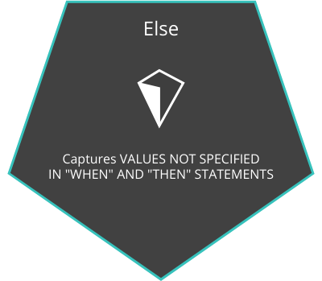
</p>

```sql
    SELECT id,
           account_id,
           occurred_at,
           channel,
           CASE WHEN channel = 'facebook' THEN 'yes' ELSE 'no' END AS is_facebook
    FROM web_events_full
    ORDER BY occurred_at
```


4. - **If we want this new column to keep track of not just our we could change our case statement to use the "OR" operator. The "WHEN" statement is a logical condition similar to what you would put in a "WHERE" clause. So you can use "AND", "LIKE", "IN" or any other operators you've already seen.**

```sql
    SELECT id,
           account_id,
           occurred_at,
           channel,
           CASE WHEN channel = 'facebook' OR channel = 'direct' THEN 'yes' ELSE 'no' END AS is_facebook
    FROM web_events_full
    ORDER BY occurred_at
```


5. - **You can use a case statement to define a number ofoutcomes by including as many "WHEN" "THEN" statements asyou'd like.In this example, the "WHEN" statementswill get evaluated in the order that they're written.So, if the value in the total column of a given row is 600,it will produce a result of over 500.If the value in the total column is 169,the database will first check to see if the total isgreater than 500 because that's the first "WHEN" statement.169 is not greater than 500,so we'll move on to evaluate the next "WHEN.This process continues until a logical "WHEN" statementevaluates totrue in which case the "THEN" statement will be recorded inthe total group column.**

```sql
    SELECT account_id,
           occurred_at,
           total,
           CASE WHEN total > 500 THEN 'Over 500'
                WHEN total > 300 THEN '301 - 500'
                WHEN total > 100 THEN '101 - 300'
                ELSE '100 or under' END AS total_group
    FROM orders
```


6. - **While the above works, it's really best to create "WHEN" statements that don't overlap. The conditional statement "when total is greater than 500" overlaps with the statement "when total is greater than 300" for every value greater than 500 which is a little confusing. A better way to write the above would be to define specific groups that don't overlap with one another. You can do this by stringing together multiple conditional statements with "AND" and "OR", the same way you might in a "WHERE" clause. In the final parts of this lesson, we'll take these casements just one step further by combining them with aggregations that we looked at earlier.**

```sql
    SELECT account_id,
           occurred_at,
           total,
           CASE WHEN total > 500 THEN 'Over 500'
                WHEN total > 300 AND total <= 500 THEN '301 - 500'
                WHEN total > 100 AND total <= 300 THEN '101 - 300'
                ELSE '100 or under' END AS total_group
    FROM orders
```


7. - **Aggregating based on these new categories will make it easier to report back to company leaders and take action. The easiest way to count all the members of a group is to create a column that groups the way you want it to, then create another column to count by that group. Here, we're using CASE to group orders into those with total quantity sold over 500, and those with 500 or less. This query is an excellent place to use numbers instead of full column calculation in the GROUP BY clause, because repeating the CASE statement in the GROUP BY would make the query obnoxiously long.**

```sql
    SELECT CASE WHEN total > 500 THEN 'Over 500' ELSE '500 or under' END AS total_group
    FROM orders
    GROUP BY 1
```


8. - **Now, you might be thinking, why wouldn't I just use a WHERE clause to filter out rows I don't want to count? You could do that, and it would look like this. Unfortunately, using the WHERE clause only allows you to count one condition at a time. This would be tedious if we had a number of different cases. We would need a separate query for each one.**

```sql
    SELECT COUNT(1) AS orders_over_500_units
    FROM orders
    WHERE total > 500
```


**CASE - Expert Tip:-**
---

- **The CASE statement always goes in the SELECT clause.**

<br>

- **CASE must include the following components: WHEN, THEN, and END. ELSE is an optional component to catch cases that didn’t meet any of the other previous CASE conditions.**

<br>

- **You can make any conditional statement using any conditional operator (like WHERE) between WHEN and THEN. This includes stringing together multiple conditional statements using AND and OR.**

<br>

- **You can include multiple WHEN statements, as well as an ELSE statement again, to deal with any unaddressed conditions.**
