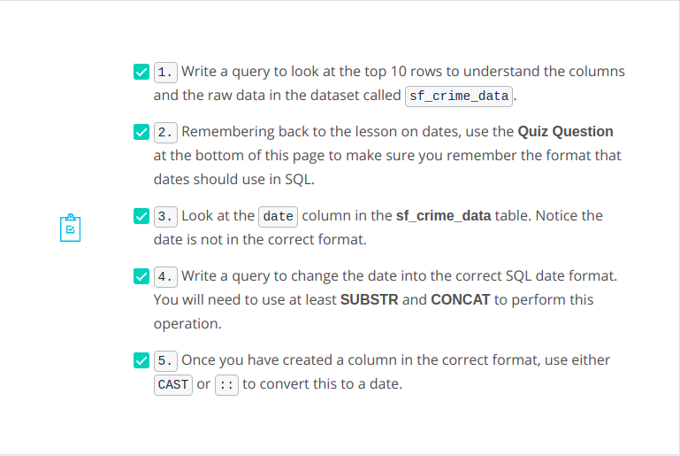

> # **LEFT & RIGHT**:-

---

- **Our goal here is to clean up this data set, to make it more useful for analysis. For text fields, that means making clean groups that will be useful to aggregate across.**

```sql
SELECT first_name,
       last_name,
       phone_number
FROM demo.customer_data
```

<p align="center">

</p>

- **Let's start by pulling the area code out of the phone number. Since the structure of a phone number in this data set is always the same, we can use that to our advantage. The area code is always the first three characters of a phone number. We can get this using a left function.**

<p align="center">

</p>

- **You can use left to pull certain number of characters from the left side of the string, and present them as a separate string.**

```sql
SELECT first_name,
       last_name,
       phone_number,
       LEFT(phone_number, 3) AS area_code
FROM demo.customer_data
```

<p align="center">

</p>

- **If we just want the phone number, we can use right, which does the same thing but from the right side.**

<p align="center">

</p>

- **Right works well in this case, because we know that the number of characters will be consistent across the entire phone number field. If it wasn't consistent, it's still possible to pull a string from the right side, in a way that makes sense.**

```sql
SELECT first_name,
       last_name,
       phone_number,
       LEFT(phone_number, 3) AS area_code,
       RIGHT(phone_number, 8) AS phone_number_only
FROM demo.customer_data
```

<p align="center">

</p>

- **The length function returns the length of the string. So, the length of the phone number will always return 12 in this dataset.**

<p align="center">

</p>

- **Since we know that the first three characters will be the area code, and they'll be followed by a dash. So, total of four characters.**

```sql
SELECT first_name,
       last_name,
       phone_number,
       LEFT(phone_number, 3) AS area_code,
       RIGHT(phone_number, 8) AS phone_number_only,
       RIGHT(phone_number, LENGTH(phone_number) - 4) AS phone_number_alt
FROM demo.customer_data
```

<p align="center">

</p>

**Examples:-**
---

1. **In the accounts table, there is a column holding the website for each company. The last three digits specify what type of web address they are using. A list of extensions (and pricing) is provided [here](https://iwantmyname.com/domains/domain-name-registration-list-of-extensions). Pull these extensions and provide how many of each website type exist in the accounts table.**

```sql
SELECT RIGHT(website, 3) AS domain, COUNT(*) num_companies
FROM accounts
GROUP BY 1
ORDER BY 2 DESC;
```

2. **There is much debate about how much the name ([or even the first letter of a company name](https://www.quora.com/Does-a-companys-name-matter)) matters. Use the accounts table to pull the first letter of each company name to see the distribution of company names that begin with each letter (or number).**

```sql
SELECT LEFT(UPPER(name), 1) AS first_letter, COUNT(*) num_companies
FROM accounts
GROUP BY 1
ORDER BY 2 DESC;
```

3. **Use the accounts table and a CASE statement to create two groups: one group of company names that start with a number and a second group of those company names that start with a letter. What proportion of company names start with a letter?**

```sql
SELECT SUM(num) nums, SUM(letter) letters
FROM (SELECT name, CASE WHEN LEFT(UPPER(name), 1) IN ('0','1','2','3','4','5','6','7','8','9') 
                       THEN 1 ELSE 0 END AS num, 
         CASE WHEN LEFT(UPPER(name), 1) IN ('0','1','2','3','4','5','6','7','8','9') 
                       THEN 0 ELSE 1 END AS letter
      FROM accounts) t1;
```

4. **Consider vowels as a, e, i, o, and u. What proportion of company names start with a vowel, and what percent start with anything else?**

```sql
SELECT SUM(vowels) vowels, SUM(other) other
FROM (SELECT name, CASE WHEN LEFT(UPPER(name), 1) IN ('A','E','I','O','U')
                        THEN 1 ELSE 0 END AS vowels, 
          CASE WHEN LEFT(UPPER(name), 1) IN ('A','E','I','O','U')
                       THEN 0 ELSE 1 END AS other
         FROM accounts) t1;
```

> # **POSITION, STRPOS, & SUBSTR**

---

- **Left and right work pretty well in specific circumstances. When the data is structured very cleanly with a certain number of characters. If you want a separate city and state, you've got to do a little more work. The first thing that will be helpful is figuring out exactly where the city and state split.**

```sql
SELECT first_name,
       last_name,
       city_state
FROM demo.customer_data
```

<p align="center">

</p>

- **Since it will be different for each row, we have to use a function that will find the comma and identify how far into the record it is. Position allows you to specify a sub-string, then it returns a numerical value equal to how far away from the left that particular character appears.**

<p align="center">

</p>

```sql
SELECT first_name,
       last_name,
       city_state,
       POSITION(',', IN city_state) AS comma_position
FROM demo.customer_data
```

<p align="center">

</p>

- **You can also use the string position function which is annotated as as STRPOS to achieve the same results. Just replace in with a comma and switch the order of the string and the sub-string.**

<p align="center">

</p>

```sql
SELECT first_name,
       last_name,
       city_state,
       STRPOS(city_state, ',') AS substr_comma_position
FROM demo.customer_data
```

**Importantly, both the position and string position functions are case sensitive. If you want to look for a character regardless of its case, you can make the entire string upper or lower case. You can use lower to force every character in a string to become lowercase. Similarly, you can use UPPER to make all the letters appear as uppercase.**

<p align="center">

</p>

```sql
SELECT first_name,
       last_name,
       city_state,
       POSITION(',', IN city_state) AS comma_position,
       STRPOS(city_state, ',') AS substr_comma_position,
       LOWER(city_state) AS lowercase
       UPPER(city_state) AS uppercase
FROM demo.customer_data
```

<p align="center">

</p>

- **Let's complete the loop and pull just the city out into its own field. We can do this by nesting the position inside a Left function. As you can see, what we really want isn't the full text up to the position of the comma, we want to end one position before the comma so that it's not included in our city column. We can do this by subtracting one within the left function.**

```sql
SELECT first_name,
       last_name,
       city_state,
       POSITION(',', IN city_state) AS comma_position,
       STRPOS(city_state, ',') AS substr_comma_position,
       LOWER(city_state) AS lowercase,
       UPPER(city_state) AS uppercase,
       LEFT(city_state, POSITION(',', IN city_state)) AS city
FROM demo.customer_data
```

<p align="center">

</p>

**Note, both <u>POSITION</u> and <u>STRPOS</u> are case sensitive, so looking for A is different than looking for a.**

**Examples:-**
---

1. **Use the accounts table to create first and last name columns that hold the first and last names for the primary_poc.**

```sql
SELECT LEFT(primary_poc, LENGTH(primary_poc) - STRPOS(primary_poc, ' ')) AS first,
       RIGHT(primary_poc, LENGTH(primary_poc) - STRPOS(primary_poc, ' ')) AS last
FROM accounts
```

2. **Now see if you can do the same thing for every rep name in the sales_reps table. Again provide first and last name columns.**

```sql
SELECT LEFT(name, LENGTH(name) - STRPOS(name, ' ')) AS first,
       RIGHT(name, LENGTH(name) - STRPOS(name, ' ')) AS last
FROM sales_reps
```

> # **CONCAT**

---

- **Now let's say we want to combine first and last names into a single full name column.**

```sql
SELECT first_name,
       last_name
FROM demo.customer_data
```

<p align="center">

</p>

- **You can combine strings from several columns using CONCAT.**

<p align="center">

</p>

- **Simply order the values you want to concatenate and separate them with commas. If you want a hard code values, enclose them in single quotes the way that I'm doing with this space.**

```sql
SELECT first_name,
       last_name,
       CONCAT(first_name, ' ', last_name) AS full_name
FROM demo.customer_data
```

<p align="center">

</p>

- **Alternatively, you can use two pipe characters to perform the same concatenation.**

```sql
SELECT first_name,
       last_name,
       CONCAT(first_name, ' ', last_name) AS full_name,
       first_name || ' ' || last_name AS full_name_alt
FROM demo.customer_data
```

<p align="center">

</p>

**Each of these will allow you to combine columns together across rows. In this video, you saw how first and last names stored in separate columns could be combined together to create a full name:**

```sql
CONCAT(first_name, ' ', last_name)
```

**or with piping as**

```sql
first_name || ' ' || last_name
```

**Examples:-**
---

1. **Each company in the accounts table wants to create an email address for each primary_poc. The email address should be the first name of the primary_poc . last name primary_poc @ company name .com.**

```sql
SELECT LEFT(primary_poc, LENGTH(primary_poc) - STRPOS(primary_poc, ' '))
|| '.' || RIGHT(primary_poc, LENGTH(primary_poc) - STRPOS(primary_poc, ' '))
|| '@' || name || '.com'
FROM accounts
```

2. **You may have noticed that in the previous solution some of the company names include spaces, which will certainly not work in an email address. See if you can create an email address that will work by removing all of the spaces in the account name, but otherwise your solution should be just as in question 1. Some helpful documentation is [here](https://www.postgresql.org/docs/8.1/static/functions-string.html).**

```sql
SELECT LEFT(primary_poc, LENGTH(primary_poc) - STRPOS(primary_poc, ' '))
|| '.' || RIGHT(primary_poc, LENGTH(primary_poc) - STRPOS(primary_poc, ' '))
|| '@' || REPLACE(name, ' ', '') || '.com'
FROM accounts
```

3. **We would also like to create an initial password, which they will change after their first log in. The first password will be the first letter of the primary_poc's first name (lowercase), then the last letter of their first name (lowercase), the first letter of their last name (lowercase), the last letter of their last name (lowercase), the number of letters in their first name, the number of letters in their last name, and then the name of the company they are working with, all capitalized with no spaces.**

```sql
SELECT LEFT(LOWER(first_name), 1) || RIGHT(LOWER(first_name), 1) ||
       LEFT(LOWER(last_name), 1) || RIGHT(LOWER(last_name), 1) ||
       LENGTH(first_name) || LENGTH(last_name) || UPPER(name) AS password
FROM (SELECT LEFT(primary_poc, STRPOS(primary_poc, ' ') - 1) AS first_name,
             RIGHT(primary_poc, LENGTH(primary_poc) - STRPOS(primary_poc, ' ')) AS last_name,
             name
      FROM accounts) data
```

> # **CAST**

---

- **We've already explored date functions like date trunc and date part. we'll dig into even more functions for getting value from dates. The vast majority of analysis you perform in a professional setting will have dates attached to it, but you might not be able to get value out of them, if the dates are not formatted correctly.**

```sql
SELECT *
FROM demo.ad_clicks
```

<p align="center">

</p>

- **In order to really maximize value here, you'll need to convert month names into numbers, then concatenate all of these fields together along with hyphens, and then tell the database to understand that the resulting output is a date, which you can do by using the cast function. Let's tackle the first couple steps of this first.**

```sql
SELECT *,
       DATE_PART('month', TO_DATE(month, 'month')) AS clean_month
FROM demo.ad_clicks
```

<p align="center">

</p>

- **This first step converted month names into numbers. As you can see, January comes out as one. Now let's concatenate that value together with the year and the day to create something that looks like a real date.**

```sql
SELECT *,
       DATE_PART('month', TO_DATE(month, 'month')) AS clean_month,
       year || '-' || DATE_PART('month', TO_DATE(month, 'month')) || '-' || day AS concatenated_data
FROM demo.ad_clicks
```

<p align="center">

</p>

- **For the last step, we'll cast this new field as a date format. You can see here that the database now understands this as a date and has attached the appropriate zeros to these records so that it reads properly.**

<p align="center">

</p>

```sql
SELECT *,
       DATE_PART('month', TO_DATE(month, 'month')) AS clean_month,
       year || '-' || DATE_PART('month', TO_DATE(month, 'month')) || '-' || day AS concatenated_data,
       CAST(year || '-' || DATE_PART('month', TO_DATE(month, 'month')) || '-' || day AS DATE) AS formatted_date
FROM demo.ad_clicks
```

<p align="center">

</p>

- **The cast function can be a little tricky to read, but luckily, there's also a shorthand. Rather than wrapping all of this in a cast function, we can simply add two colons and then the data type we'd like to cast at the end of this section. The cast function is most useful for turning strings into numbers or dates.**

```sql
SELECT *,
       DATE_PART('month', TO_DATE(month, 'month')) AS clean_month,
       year || '-' || DATE_PART('month', TO_DATE(month, 'month')) || '-' || day AS concatenated_data,
       CAST(year || '-' || DATE_PART('month', TO_DATE(month, 'month')) || '-' || day AS DATE) AS formatted_date,
       (year || '-' || DATE_PART('month', TO_DATE(month, 'month')) || '-' || day)::DATE AS foramtted_date_alt
FROM demo.ad_clicks
```

<p align="center">

</p>

**Examples:-**
---

<p align="center">

</p>

1. ```sql
      SELECT *
      FROM sf_crime_data
      LIMIT 10;
   ```

2. **yyyy-mm-dd**

3. **The format of the date column is mm/dd/yyyy with times that are not correct also at the end of the date.**

4. ```sql
      SELECT date orig_date, (SUBSTR(date, 7, 4) || '-'
      || LEFT(date, 2) || '-'
      || SUBSTR(date, 4, 2)) new_date
      FROM sf_crime_data;
   ```

5. **Notice, this new date can be operated on using DATE_TRUNC and DATE_PART in the same way as earlier lessons.**

```sql
SELECT date orig_date, (SUBSTR(date, 7, 4) || '-'
|| LEFT(date, 2) || '-'
|| SUBSTR(date, 4, 2))::DATE new_date
FROM sf_crime_data;
```

**Pro Tips:-**
---


<p align="center">

</p>

> # **COALESCE**

---

- **Occasionally, you'll end up with a data set that has some nulls that you'd prefer to contain actual values.**

```sql
SELECT *
FROM demo.accounts
WHERE primary_poc IS NULL
```

<p align="center">

</p>

- **Looking at the accounts table, you might want to clearly label a no primary point of contact as no POC, so the results will be easily understandable. In cases like this, you can use coalesce to replace the null values.**

<p align="center">

</p>

- **This is something you may want to do frequently when using numerical data where you might want to display nulls as zero.**

```sql
SELECT *,
       COALESCE(primary_poc, 'no POC') AS primary_poc_modified
FROM demo.accounts
WHERE primary_poc IS NULL
```

<p align="center">

</p>

- **Also, when performing outer joins that result in some unmatched rows, you may want those unmatched rows to display something other than a null value. Of course, this is most valuable when working with a function that treats nulls differently from zero such as a count or an average. We can demonstrate this by wrapping the coalesce in a count function and counting the primary POC column without the coalesce, as well.**

```sql
SELECT COUNT(primary_poc) AS regular_count,
       COUNT(COALESCE(primary_poc, 'no POC')) AS modified_count
FROM demo.accounts
```

<p align="center">

</p>

**Examples:-**
---

<p align="center">

</p>

1. ```sql
      SELECT *
      FROM accounts a
      LEFT JOIN orders o
      ON a.id = o.account_id
      WHERE o.total IS NULL;
   ```

2. ```sql
   SELECT COALESCE(a.id, a.id) filled_id, a.name,
   a.website, a.lat, a.long, a.primary_poc,
   a.sales_rep_id, o.*
   FROM accounts a
   LEFT JOIN orders o
   ON a.id = o.account_id
   WHERE o.total IS NULL;
   ```

3. ```sql
   SELECT COALESCE(a.id, a.id) filled_id, a.name,
   a.website, a.lat, a.long, a.primary_poc, a.sales_rep_id,
   COALESCE(o.account_id, a.id) account_id,
   o.occurred_at, o.standard_qty, o.gloss_qty, 
   .poster_qty, o.total, o.standard_amt_usd,
   o.gloss_amt_usd, o.poster_amt_usd, o.total_amt_usd
   FROM accounts a
   LEFT JOIN orders o
   ON a.id = o.account_id
   WHERE o.total IS NULL;
   ```

4. ```sql
   SELECT COALESCE(a.id, a.id) filled_id, a.name, a.website,
    a.lat, a.long, a.primary_poc, a.sales_rep_id,
    COALESCE(o.account_id, a.id) account_id, o.occurred_at,
    COALESCE(o.standard_qty, 0) standard_qty,
    COALESCE(o.gloss_qty,0) gloss_qty,
    COALESCE(o.poster_qty,0) poster_qty,
    COALESCE(o.total,0) total,
    COALESCE(o.standard_amt_usd,0) standard_amt_usd,
    COALESCE(o.gloss_amt_usd,0) gloss_amt_usd,
    COALESCE(o.poster_amt_usd,0) poster_amt_usd,
    COALESCE(o.total_amt_usd,0) total_amt_usd
   FROM accounts a
   LEFT JOIN orders o
   ON a.id = o.account_id
   WHERE o.total IS NULL;
   ```

5. ```sql
   SELECT COUNT(*)
   FROM accounts a
   LEFT JOIN orders o
   ON a.id = o.account_id;
   ```

6. ```sql
   SELECT COALESCE(a.id, a.id) filled_id, a.name,
   a.website, a.lat, a.long, a.primary_poc,
   a.sales_rep_id,
   COALESCE(o.account_id, a.id) account_id, o.occurred_at,
   COALESCE(o.standard_qty, 0) standard_qty,
   COALESCE(o.gloss_qty,0) gloss_qty,
   COALESCE(o.poster_qty,0) poster_qty,
   COALESCE(o.total,0) total,
   COALESCE(o.standard_amt_usd,0) standard_amt_usd,
   COALESCE(o.gloss_amt_usd,0) gloss_amt_usd,
   COALESCE(o.poster_amt_usd,0) poster_amt_usd,
   COALESCE(o.total_amt_usd,0) total_amt_usd
   FROM accounts a
   LEFT JOIN orders o
   ON a.id = o.account_id;
   ```