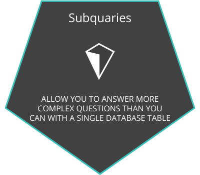
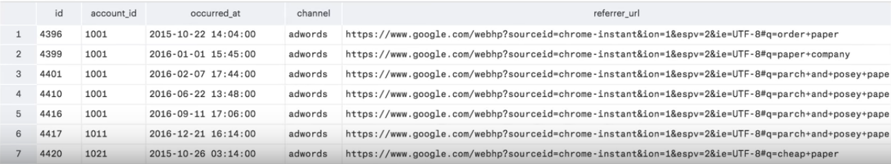
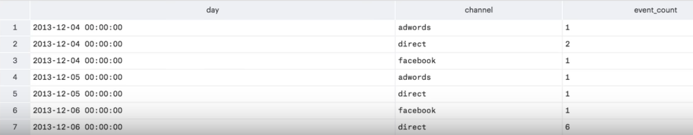
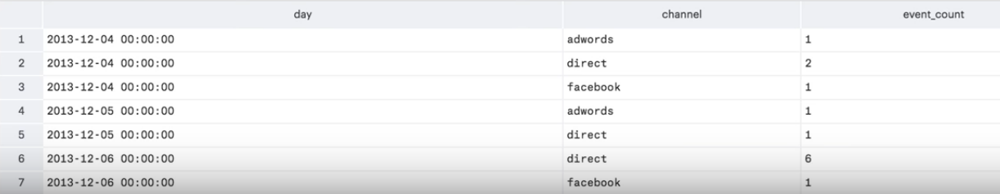
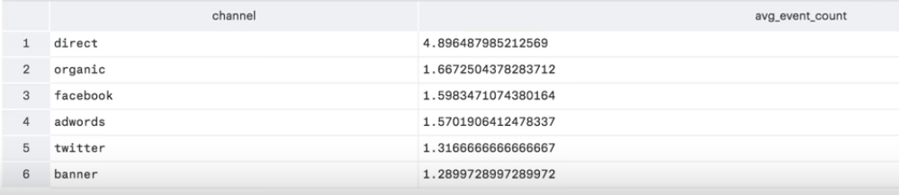
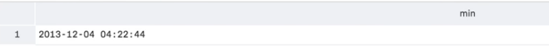
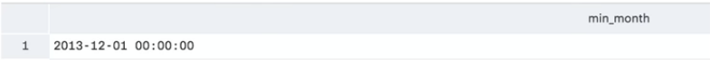
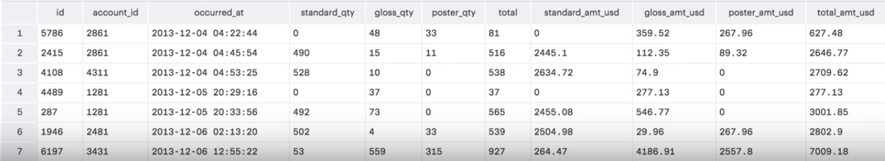
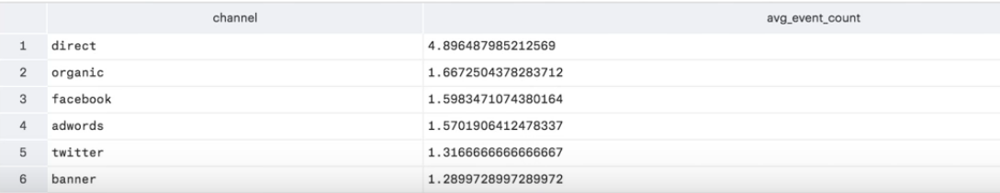

> # **Subquaries:-**

---

<p align="center">

</p>

**Illustraion:-**
---

- **First, we'll start by querying the underlying table to make sure that data makes sense for what we're trying to do.**

```sql
    SELECT *
    FROM demo.web_events_full
```

<p align="center">

</p>

- **Next, we'll count up all the events in each channel, in each day.**

```sql
    SELECT DATE_TRUNC('day', occurred_at) AS day,
           channel,
           COUNT(*) AS event_count
    FROM demo.web_events_full
    GROUP BY 1,2
    ORDER BY 1
```

<p align="center">

</p>

- **The last step is that we want to average across the events column we've created. In order to do that, we'll want to query against the results from this query. We can do that by wrapping the query in parentheses and using it in the FROM clause of the next query that we write. It is now a query within a query, also known as a subquery. Subqueries are required to have aliases, which are added after the parentheses, the same way you would add an alias to a table. Here, we're just selecting all of the data from the subquery.**

```sql
    SELECT *
    FROM (SELECT DATE_TRUNC('day', occurred_at) AS day,
           channel,
           COUNT(*) AS event_count
    FROM demo.web_events_full
    GROUP BY 1,2
    ORDER BY 1) sub
```

<p align="center">

</p>

- **Let's go the last mile and average events for each channel. Since the subquery acts like one table in the FROM clause, we'll put a GROUP BY clause after the subquery. Since we're now reordering based on this new aggregation, we no longer need the ORDER BY statement in the subquery. So let's take that out to keep things clean.**

```sql
    SELECT channel,
           AVG(event_count) AS avg_event_count
    FROM (SELECT DATE_TRUNC('day', occurred_at) AS day,
            channel,
            COUNT(*) AS event_count
            FROM demo.web_events_full
            GROUP BY 1,2) sub
    GROUP BY 1
    ORDER BY 2
```

<p align="center">

</p>


**Examples:-**
---

1. **First, we needed to group by the day and channel. Then ordering by the number of events (the third column) gave us a quick way to answer the first question.**

```sql
    SELECT DATE_TRUNC('day',occurred_at) AS day,
           channel, COUNT(*) as events
    FROM web_events
    GROUP BY 1,2
    ORDER BY 3 DESC;
```

2. **Here you can see that to get the entire table in question 1 back, we included an * in our SELECT statement. You will need to be sure to alias your table.**

```sql
    SELECT *
    FROM (SELECT DATE_TRUNC('day',occurred_at) AS day,
                 channel, COUNT(*) as events
            FROM web_events 
            GROUP BY 1,2
            ORDER BY 3 DESC) sub;
```

3. **Finally, here we are able to get a table that shows the average number of events a day for each channel.**

```sql
    SELECT channel, AVG(events) AS average_events
    FROM (SELECT DATE_TRUNC('day',occurred_at) AS day,
                 channel, COUNT(*) as events
            FROM web_events
            GROUP BY 1,2) sub;
    GROUP BY channel
    ORDER BY 2 DESC;
```

> # **Subquaries Formatting:-**

---

- **When writing <u>Subqueries</u>, it is easy for your query to look incredibly complex. In order to assist your reader, which is often just yourself at a future date, formatting SQL will help with understanding your code.**

- **The important thing to remember when using subqueries is to provide some way for the reader to easily determine which parts of the query will be executed together. Most people do this by indenting the subquery in some way - you saw this with the solution blocks in the previous concept.**

- **The examples in this class are indented quite far—all the way to the parentheses. This isn’t practical if you nest many subqueries, but in general, be thinking about how to write your queries in a readable way. Examples of the same query written multiple different ways is provided below. You will see that some are much easier to read than others.**

---

**Badly Formatted Queries**

- **Though these poorly formatted examples will execute the same way as the well formatted examples, they just aren't very friendly for understanding what is happening!**

- **Here is the first, where it is impossible to decipher what is going on:**

```sql
    SELECT * FROM (SELECT DATE_TRUNC('day',occurred_at) AS day, channel, COUNT(*) as events FROM web_events GROUP BY 1,2 ORDER BY 3 DESC) sub;
```

**This second version, which includes some helpful line breaks, is easier to read than that previous version, but it is still not as easy to read as the queries in the <u>Well Formatted Query</u> section.**

```sql
    SELECT *
    FROM (
    SELECT DATE_TRUNC('day',occurred_at) AS day,
    channel, COUNT(*) as events
    FROM web_events 
    GROUP BY 1,2
    ORDER BY 3 DESC) sub;
```

---

**Well Formatted Query**

- **Now for a well formatted example, you can see the table we are pulling from much easier than in the previous queries.**

```sql
    SELECT *
    FROM (SELECT DATE_TRUNC('day',occurred_at) AS day,
                channel, COUNT(*) as events
          FROM web_events 
          GROUP BY 1,2
          ORDER BY 3 DESC) sub;
```

**Additionally, if we have a <u>GROUP BY, ORDER BY, WHERE, HAVING</u>, or any other statement following our subquery, we would then indent it at the same level as our outer query.**

**The query below is similar to the above, but it is applying additional statements to the outer query, so you can see there are <u>GROUP BY</u> and <u>ORDER BY</u> statements used on the output are not tabbed. The inner query <u>GROUP BY</u> and <u>ORDER BY</u> statements are indented to match the inner table.**

```sql
    SELECT *
    FROM (SELECT DATE_TRUNC('day',occurred_at) AS day,
                channel, COUNT(*) as events
          FROM web_events 
          GROUP BY 1,2
          ORDER BY 3 DESC) sub
    GROUP BY day, channel, events
    ORDER BY 2 DESC;
```

> # **More Subquaries:-**

---

- **Subqueries can be used in several places within a query. It can really be used anywhere you might use a table name or even a column name or an individual value. They're especially useful in conditional logic, in conjunction with where or Join clauses, or in the when portion of a case statement.**

```sql
    SELECT MIN(occurred_at) AS min
    FROM demo.orders
```

<p align="center">

</p>

- **For example, you might want to return only orders that occurred in the same month as Parch and Posies first order ever. To get the date of the first order, you can write a subquery with a min function. Let's add a date_trunc function to get the month.**

```sql
    SELECT DATE_TRUNC('month',MIN(occurred_at)) AS min_month
    FROM demo.orders
```

<p align="center">

</p>

- **Finally, let's write an outer query that uses this to filter the orders table and sorts by the occurred at column. You can see that all of these orders took place in December 2013, the same month as the first order. This query works because the result of the subquery is only one cell. Most conditional logic will work with subqueries containing one-cell results. But IN is the only type of conditional logic that will work when the inner query contains multiple results.**

```sql
    SELECT *
    FROM demo.orders
    WHERE DATE_TRUNC('month', occurred_at) = (SELECT DATE_TRUNC('month',MIN(occurred_at)) AS min_month
                                              FROM demo.orders)
    ORDER BY occurred_at
```

<p align="center">

</p>

**Expert Tip:-**
---

- **Note that you should not include an alias when you write a subquery in a conditional statement. This is because the subquery is treated as an individual value (or set of values in the <u>IN</u> case) rather than as a table.**

- **Also, notice the query here compared a single value. If we returned an entire column <u>IN</u> would need to be used to perform a logical argument. If we are returning an entire table, then we must use an <u>ALIAS</u> for the table, and perform additional logic on the entire table.**

**Examples:-**
---

1. **Here is the necessary quiz to pull the first month/year combo from the orders table.**

```sql
    SELECT DATE_TRUNC('month', MIN(occurred_at)) 
    FROM orders;
```

2. **Then to pull the average for each, we could do this all in**

```sql
    SELECT AVG(standard_qty) avg_std, AVG(gloss_qty) avg_gls, AVG(poster_qty) avg_pst
    FROM orders
    WHERE DATE_TRUNC('month', occurred_at) = 
        (SELECT DATE_TRUNC('month', MIN(occurred_at)) FROM orders);

    SELECT SUM(total_amt_usd)
    FROM orders
    WHERE DATE_TRUNC('month', occurred_at) = 
        (SELECT DATE_TRUNC('month', MIN(occurred_at)) FROM orders);
```

3. **Provide the name of the sales_rep in each region with the largest amount of total_amt_usd sales.**

```sql
SELECT t3.rep_name, t3.region_name, t3.total_amt
FROM(SELECT region_name, MAX(total_amt) total_amt
     FROM(SELECT s.name rep_name, r.name region_name, SUM(o.total_amt_usd) total_amt
             FROM sales_reps s
             JOIN accounts a
             ON a.sales_rep_id = s.id
             JOIN orders o
             ON o.account_id = a.id
             JOIN region r
             ON r.id = s.region_id
             GROUP BY 1, 2) t1
     GROUP BY 1) t2
JOIN (SELECT s.name rep_name, r.name region_name, SUM(o.total_amt_usd) total_amt
     FROM sales_reps s
     JOIN accounts a
     ON a.sales_rep_id = s.id
     JOIN orders o
     ON o.account_id = a.id
     JOIN region r
     ON r.id = s.region_id
     GROUP BY 1,2
     ORDER BY 3 DESC) t3
ON t3.region_name = t2.region_name AND t3.total_amt = t2.total_amt;
```

4. **For the region with the largest sales total_amt_usd, how many total orders were placed?**

```sql
SELECT r.name, COUNT(o.total) total_orders
FROM sales_reps s
JOIN accounts a
ON a.sales_rep_id = s.id
JOIN orders o
ON o.account_id = a.id
JOIN region r
ON r.id = s.region_id
GROUP BY r.name
HAVING SUM(o.total_amt_usd) = (
      SELECT MAX(total_amt)
      FROM (SELECT r.name region_name, SUM(o.total_amt_usd) total_amt
              FROM sales_reps s
              JOIN accounts a
              ON a.sales_rep_id = s.id
              JOIN orders o
              ON o.account_id = a.id
              JOIN region r
              ON r.id = s.region_id
              GROUP BY r.name) sub);
```

5. **For the account that purchased the most (in total over their lifetime as a customer) standard_qty paper, how many accounts still had more in total purchases?**

```sql
SELECT a.name
FROM orders o
JOIN accounts a
ON a.id = o.account_id
GROUP BY 1
HAVING SUM(o.total) > (SELECT total 
                  FROM (SELECT a.name act_name, SUM(o.standard_qty) tot_std, SUM(o.total) total
                        FROM accounts a
                        JOIN orders o
                        ON o.account_id = a.id
                        GROUP BY 1
                        ORDER BY 2 DESC
                        LIMIT 1) sub);
```

6. **For the customer that spent the most (in total over their lifetime as a customer) total_amt_usd, how many web_events did they have for each channel?**

```sql
SELECT a.name, w.channel, COUNT(*)
FROM accounts a
JOIN web_events w
ON a.id = w.account_id AND a.id =  (SELECT id
                     FROM (SELECT a.id, a.name, SUM(o.total_amt_usd) tot_spent
                           FROM orders o
                           JOIN accounts a
                           ON a.id = o.account_id
                           GROUP BY a.id, a.name
                           ORDER BY 3 DESC
                           LIMIT 1) inner_table)
GROUP BY 1, 2
ORDER BY 3 DESC;
```

7. **What is the lifetime average amount spent in terms of total_amt_usd for the top 10 total spending accounts?**

```sql
SELECT AVG(tot_spent)
FROM (SELECT a.id, a.name, SUM(o.total_amt_usd) tot_spent
      FROM orders o
      JOIN accounts a
      ON a.id = o.account_id
      GROUP BY a.id, a.name
      ORDER BY 3 DESC
       LIMIT 10) temp;
```

8. **What is the lifetime average amount spent in terms of total_amt_usd for only the companies that spent more than the average of all orders.**

```sql
SELECT AVG(avg_amt)
FROM (SELECT o.account_id, AVG(o.total_amt_usd) avg_amt
    FROM orders o
    GROUP BY 1
    HAVING AVG(o.total_amt_usd) > (SELECT AVG(o.total_amt_usd) avg_all
                                   FROM orders o)) temp_table;
```

> # **WITH:-**

---

**The WITH statement is often called a Common Table Expression or CTE. Though these expressions serve the exact same purpose as subqueries, they are more common in practice, as they tend to be cleaner for a future reader to follow the logic.**

**Illustration:-**
---

- **One problem with subqueries is that they can make your queries lengthy and difficult to read. Common Table expressions or CTEs can help break your query into separate components so that your query logic is more easily readable. You can read the subqueries logic on its own and then read the final queries logic easily as well. Let's look back over this example in which we found the average number of events per day in each marketing channel.**

```sql
SELECT channel,
        AVG(events_counts) AS avg_event_count
FROM
        (SELECT DATE_TRUNC('day', occurred_at) AS day,
                channel,
                COUNT(*) AS event_count
        FROM demo.web_events
        GROUP BY 1,2)sub
GROUP BY 1
ORDER BY 2 DESC
```

<p align="center">

</p>

- **Let's break the subquery out into his own common table expression which we'll create using the WITH command. Here, we're only defining this one common table expression but we could theoretically write as many as we want. We need to define any common table expressions at the beginning of the query in order to use them in our final query at the bottom. Each common table expression gets an alias just like a subquery.**

```sql
WITH events AS (SELECT DATE_TRUNC('day', occurred_at) AS day,
                channel,
                COUNT(*) AS event_count
        FROM demo.web_events
        GROUP BY 1,2)


SELECT channel,
        AVG(events_counts) AS avg_event_count
FROM events
GROUP BY 1
ORDER BY 2 DESC
```

<p align="center">

</p>

**Examples:-**
---

1. **Provide the name of the sales_rep in each region with the largest amount of total_amt_usd sales.**

```sql
WITH t1 AS (
  SELECT s.name rep_name, r.name region_name, SUM(o.total_amt_usd) total_amt
   FROM sales_reps s
   JOIN accounts a
   ON a.sales_rep_id = s.id
   JOIN orders o
   ON o.account_id = a.id
   JOIN region r
   ON r.id = s.region_id
   GROUP BY 1,2
   ORDER BY 3 DESC), 
t2 AS (
   SELECT region_name, MAX(total_amt) total_amt
   FROM t1
   GROUP BY 1)
SELECT t1.rep_name, t1.region_name, t1.total_amt
FROM t1
JOIN t2
ON t1.region_name = t2.region_name AND t1.total_amt = t2.total_amt;
```

2. **For the region with the largest sales total_amt_usd, how many total orders were placed?**

```sql
WITH t1 AS (
   SELECT r.name region_name, SUM(o.total_amt_usd) total_amt
   FROM sales_reps s
   JOIN accounts a
   ON a.sales_rep_id = s.id
   JOIN orders o
   ON o.account_id = a.id
   JOIN region r
   ON r.id = s.region_id
   GROUP BY r.name), 
t2 AS (
   SELECT MAX(total_amt)
   FROM t1)
SELECT r.name, COUNT(o.total) total_orders
FROM sales_reps s
JOIN accounts a
ON a.sales_rep_id = s.id
JOIN orders o
ON o.account_id = a.id
JOIN region r
ON r.id = s.region_id
GROUP BY r.name
HAVING SUM(o.total_amt_usd) = (SELECT * FROM t2);
```

3. **For the account that purchased the most (in total over their lifetime as a customer) standard_qty paper, how many accounts still had more in total purchases?**

```sql
WITH t1 AS (
  SELECT a.name account_name, SUM(o.standard_qty) total_std, SUM(o.total) total
  FROM accounts a
  JOIN orders o
  ON o.account_id = a.id
  GROUP BY 1
  ORDER BY 2 DESC
  LIMIT 1), 
t2 AS (
  SELECT a.name
  FROM orders o
  JOIN accounts a
  ON a.id = o.account_id
  GROUP BY 1
  HAVING SUM(o.total) > (SELECT total FROM t1))
SELECT COUNT(*)
FROM t2;
```

4. **For the customer that spent the most (in total over their lifetime as a customer) total_amt_usd, how many web_events did they have for each channel?**

```sql
WITH t1 AS (
   SELECT a.id, a.name, SUM(o.total_amt_usd) tot_spent
   FROM orders o
   JOIN accounts a
   ON a.id = o.account_id
   GROUP BY a.id, a.name
   ORDER BY 3 DESC
   LIMIT 1)
SELECT a.name, w.channel, COUNT(*)
FROM accounts a
JOIN web_events w
ON a.id = w.account_id AND a.id =  (SELECT id FROM t1)
GROUP BY 1, 2
ORDER BY 3 DESC;
```

5. **What is the lifetime average amount spent in terms of total_amt_usd for the top 10 total spending accounts?**

```sql
WITH t1 AS (
   SELECT a.id, a.name, SUM(o.total_amt_usd) tot_spent
   FROM orders o
   JOIN accounts a
   ON a.id = o.account_id
   GROUP BY a.id, a.name
   ORDER BY 3 DESC
   LIMIT 10)
SELECT AVG(tot_spent)
FROM t1;
```

6. **What is the lifetime average amount spent in terms of total_amt_usd for only the companies that spent more than the average of all accounts.**

```sql
WITH t1 AS (
   SELECT AVG(o.total_amt_usd) avg_all
   FROM orders o
   JOIN accounts a
   ON a.id = o.account_id),
t2 AS (
   SELECT o.account_id, AVG(o.total_amt_usd) avg_amt
   FROM orders o
   GROUP BY 1
   HAVING AVG(o.total_amt_usd) > (SELECT * FROM t1))
SELECT AVG(avg_amt)
FROM t2;
```